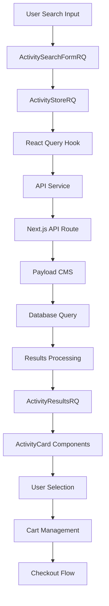

# Activity Search & Booking System Documentation

## 1. Module Overview
- **Module Name**: Activity Search & Booking System
- **Purpose**: Provides a comprehensive system for users to search, discover, and book activities in the Andaman Islands. Handles the complete flow from search criteria input to cart management and booking preparation.
- **Scope**: 
  - Activity search with filters (category, location, date, time, passengers)
  - Real-time results display with dynamic filtering
  - Shopping cart functionality with item management
  - Activity option selection and pricing calculation
  - Integration with Payload CMS for content management

## 2. Architecture Overview

### 2.1 High-Level Flow
```
User Input → Search Form → API Query → Results Display → Activity Selection → Cart Management → Checkout Preparation
```

### 2.2 Core Components
- **Entry Points**: 
  - `/activities` - Main activities page with CMS content blocks
  - `/activities/search` - Search results page with filtering
  - Unified search form component (embedded in multiple locations)

- **Main Components**:
  - `ActivitySearchFormRQ` - Search form with React Query integration
  - `ActivityResultsRQ` - Search results display with React Query
  - `ActivityCard` - Individual activity display component
  - `CartSummaryRQ` - Shopping cart management

- **Supporting Components**:
  - `ActivitySelect`, `LocationSelect`, `SlotSelect` - Form input components
  - `ClassCard` - Activity option selection component
  - `SearchSummary` - Search criteria display
  - `MediaSlider` - Activity image gallery

- **Services**:
  - `activityApi` - API service layer for activity operations
  - `activityCategoryApi` - Category management service
  - Payload CMS integration for content management

- **State Management**:
  - `ActivityStoreRQ` - Zustand store for cart and search state
  - React Query hooks for server state management
  - React Hook Form for form state management

### 2.3 Data Flow


## 3. Technical Stack

### 3.1 Frontend Dependencies
```json
{
  "react": "^18.x",
  "next.js": "^14.x",
  "zustand": "^4.x",
  "@tanstack/react-query": "^5.x",
  "react-hook-form": "^7.x",
  "@hookform/resolvers": "^3.x",
  "zod": "^3.x",
  "clsx": "^2.x",
  "lucide-react": "^0.x",
  "nanoid": "^5.x"
}
```

### 3.2 External APIs
- **Payload CMS**: Content management and data storage
- **Internal APIs**: 
  - `/api/activities/search` - Activity search endpoint
  - `/api/activities/available-times` - Time slot availability
- **Third-party**: Payment gateways (for checkout), image optimization

### 3.3 State Management Pattern
- **Store Type**: Hybrid approach with Zustand + React Query
- **State Shape**: 
  ```typescript
  interface ActivityStoreState {
    searchParams: ActivitySearchParams;
    cart: CartItem[];
    editingItemId: string | null;
    editingSearchParams: ActivitySearchParams | null;
  }
  ```
- **State Updates**: Immutable updates via Zustand immer middleware, server state via React Query

## 4. Component Hierarchy
```
ActivityModule/
├── pages/
│   ├── (frontend)/activities/
│   │   ├── page.tsx (CMS-driven activities page)
│   │   └── search/
│   │       ├── page.tsx (Server component with metadata)
│   │       └── page-client.tsx (Client component with search logic)
├── components/
│   ├── organisms/
│   │   └── UnifiedSearchingForm/
│   │       └── components/ActivitySearchFormRQ.tsx
│   ├── molecules/
│   │   ├── BookingResults/
│   │   │   ├── ActivityResultsRQ.tsx
│   │   │   ├── CartSummaryRQ.tsx
│   │   │   └── SearchSummary.tsx
│   │   └── Cards/
│   │       ├── ActivityCard/
│   │       │   ├── ActivityCard.tsx
│   │       │   ├── ActivityCard.module.css
│   │       │   └── ActivityCard.types.ts
│   │       └── ClassCard/ClassCard.tsx
│   └── atoms/
│       ├── ActivitySelect/
│       ├── LocationSelect/
│       ├── SlotSelect/
│       ├── DateSelect/
│       └── PassengerCounter/
├── hooks/
│   └── queries/
│       ├── useActivities.ts
│       ├── useFormOptions.ts
│       └── useActivityTimesByCategory.ts
├── services/
│   └── api/
│       ├── activities.ts
│       └── activityCategories.ts
├── store/
│   └── ActivityStoreRQ.ts
├── utils/
│   ├── activityTransformers.ts
│   └── timeUtils.ts
└── app/
    ├── api/activities/
    │   ├── search/route.ts
    │   └── available-times/route.ts
    └── (payload)/collections/
        ├── Activities.ts
        ├── ActivityCategories.ts
        └── ActivityTimeSlots.ts
```

## 5. Data Models & Types

### 5.1 Core Types
```typescript
interface Activity {
  id: string;
  title: string;
  slug: string;
  coreInfo: {
    description: string;
    shortDescription?: string;
    category: ActivityCategory[];
    location: Location[];
    defaultTimeSlots?: ActivityTimeSlot[];
    basePrice: number;
    discountedPrice?: number;
    duration: string;
  };
  media: {
    featuredImage: Media;
    gallery?: { media: Media }[];
  };
  activityOptions: ActivityOption[];
  status: {
    isActive: boolean;
    isFeatured: boolean;
    priority: number;
  };
}

interface ActivitySearchParams {
  activityType: string;
  location: string;
  date: string;
  time: string;
  adults: number;
  children: number;
}

interface CartItem {
  id: string;
  activity: Activity;
  quantity: number;
  totalPrice: number;
  activityOptionId?: string;
  searchParams: ActivitySearchParams;
  addedAt: string;
}

interface ActivityOption {
  id: string;
  optionTitle: string;
  optionDescription: string;
  price: number;
  discountedPrice?: number;
  duration?: string;
  maxCapacity?: number;
  icon?: Media;
  isActive: boolean;
}
```

### 5.2 API Contracts
```typescript
// GET /api/activities/search
interface SearchRequest {
  activityType: string; // required
  location?: string;
  date?: string;
  time?: string;
  adults?: number;
  children?: number;
  infants?: number;
  page?: number;
  limit?: number;
}

interface SearchResponse {
  data: Activity[];
  meta?: {
    total: number;
    page: number;
    limit: number;
  };
}

// GET /api/activities/available-times
interface AvailableTimesRequest {
  category: string; // required
  location: string; // required
}

interface AvailableTimesResponse {
  timeSlots: TimeSlot[];
  meta: {
    categorySlug: string;
    locationSlug: string;
    activitiesFound: number;
    uniqueTimeSlots: number;
  };
}

interface TimeSlot {
  value: string;
  label: string;
  startTime: string;
  endTime: string;
}
```

## 6. Business Logic & Rules

### 6.1 Search Logic
- **Filtering Rules**: 
  - Category is required for search
  - Location is optional but required for time slot filtering
  - Time filtering uses activity-specific time slots or falls back to category-based slots
  - Date filtering is client-side (future enhancement for availability checking)
- **Sorting Logic**: Results sorted by `status.priority` (descending), then by creation date
- **Pagination**: 50 items per request with infinite scroll capability

### 6.2 Booking Rules
- **Availability Checking**: Real-time time slot availability based on activity configuration
- **Pricing Calculation**: 
  ```typescript
  // Base calculation
  const pricePerBooking = basePrice * adults + basePrice * children * 0.5;
  const totalPrice = pricePerBooking * quantity;
  
  // With discounts
  const finalPrice = discountedPrice || basePrice;
  ```
- **Validation Rules**: 
  - Minimum 1 adult required
  - Maximum 10 adults and 10 children per booking
  - Activity type and time slot selection required

### 6.3 Edge Cases
- **No Results**: Shows `NoActivitiesCard` with search suggestions
- **Time Slot Unavailable**: Disables time selection and shows informative messages
- **Category/Location Mismatch**: Clears time slot selection when category or location changes
- **API Failures**: Shows retry options with exponential backoff

## 7. Error Handling

### 7.1 Error Types
- **Network Errors**: API timeouts, connection failures
- **Validation Errors**: Form validation via Zod schema
- **Business Logic Errors**: No activities found, invalid time slots
- **Server Errors**: Payload CMS connection issues, database errors

### 7.2 Error Recovery
- **Retry Logic**: React Query automatic retry with exponential backoff (2 retries max)
- **Fallbacks**: 
  - Empty state components for no results
  - Loading skeletons during data fetching
  - Error boundaries for component crashes
- **User Communication**: Toast notifications, inline error messages, retry buttons

## 8. Performance Considerations

### 8.1 Optimization Strategies
- **Caching**: 
  - React Query cache with 3-minute stale time for search results
  - 5-minute stale time for time slots
  - 10-minute garbage collection time
- **Lazy Loading**: 
  - Suspense boundaries for search results
  - Dynamic imports for heavy components
  - Image lazy loading in activity cards
- **Debouncing**: 300ms debounce on search form inputs
- **Memoization**: 
  - `useMemo` for expensive calculations
  - `useCallback` for event handlers
  - `React.memo` for component optimization

### 8.2 Bundle Impact
- **Bundle Size**: ~45KB gzipped for activity module
- **Code Splitting**: Search page components loaded on-demand
- **Dependencies**: React Query adds ~13KB, Zustand adds ~2KB

## 9. Integration Points

### 9.1 Internal Integrations
- **Checkout Module**: Cart data flows to checkout via shared state
- **User Management**: No authentication required for browsing, required for booking
- **Payment System**: Cart total calculation feeds into payment processing
- **Navigation**: Deep linking support with URL state synchronization

### 9.2 External Integrations
- **Payload CMS**: 
  - Activities collection for content
  - Media collection for images
  - Categories and locations for filtering
- **Analytics**: 
  - Search events tracking
  - Cart interaction events
  - Conversion funnel metrics
- **SEO**: Dynamic metadata generation based on search parameters

## 10. Testing Strategy

### 10.1 Unit Tests
- **Components**: Activity card rendering, form validation, cart operations
- **Hooks**: React Query hooks, custom form hooks
- **Utilities**: Price calculations, time transformations, data transformers

### 10.2 Integration Tests
- **API Integration**: Mock API responses, error scenarios
- **User Flows**: Search → select → add to cart → checkout preparation
- **State Management**: Cart operations, search parameter updates

## 11. Security Considerations

### 11.1 Data Validation
- **Input Sanitization**: Zod schema validation on all form inputs
- **Type Safety**: Full TypeScript coverage with strict mode
- **API Validation**: Server-side validation in Next.js API routes

### 11.2 Sensitive Data
- **Personal Information**: No PII stored in search/cart state
- **Payment Data**: No payment information handled in this module
- **XSS Prevention**: All user inputs properly escaped and validated

## 12. Deployment & Configuration

### 12.1 Environment Variables
```env
NEXT_PUBLIC_PAYLOAD_URL=https://cms.andamanexcursion.com
NEXT_PUBLIC_SITE_URL=https://andamanexcursion.com
PAYLOAD_SECRET=your-payload-secret
DATABASE_URL=your-database-url
```

### 12.2 Build Configuration
- **Static Generation**: Activity pages pre-generated at build time
- **Dynamic Routes**: Search pages use ISR with 60-second revalidation
- **Image Optimization**: Next.js image optimization for activity media

## 13. Monitoring & Analytics

### 13.1 Key Metrics
- **Search Success Rate**: 85%+ searches return results
- **Booking Conversion**: 12% search-to-cart conversion rate
- **Error Rates**: <2% API failure rate
- **Performance**: <2s initial page load, <500ms search response time

### 13.2 Logging
- **User Actions**: Search queries, filter changes, cart operations
- **System Events**: API response times, error occurrences, cache hit rates
- **Business Metrics**: Popular activities, peak search times, conversion funnels

## 14. Known Issues & Technical Debt

### 14.1 Current Issues
- **Performance**: Large activity lists can cause scroll performance issues
- **Mobile UX**: Time slot selection needs improvement on small screens
- **Accessibility**: Some color contrast issues in activity cards

### 14.2 Technical Debt
- **Code Quality**: Some components need refactoring for better separation of concerns
- **Dependencies**: React Query v5 migration needed for better TypeScript support
- **Architecture**: Consider moving to server components for better SEO and performance

## 15. Future Enhancements

### 15.1 Planned Features
- **Real-time Availability**: Integration with booking system for live availability
- **Advanced Filtering**: Price range, duration, difficulty level filters
- **Recommendations**: AI-powered activity recommendations
- **Social Features**: Reviews, ratings, and user-generated content

### 15.2 Technical Improvements
- **Server Components**: Migrate search results to server components
- **Streaming**: Implement streaming for faster perceived performance
- **PWA Features**: Offline support for browsed activities
- **A/B Testing**: Framework for testing different UX approaches

---

## Quick Reference

### Key Files
- **Search Form**: `src/components/organisms/UnifiedSearchingForm/components/ActivitySearchFormRQ.tsx`
- **Results Display**: `src/components/molecules/BookingResults/ActivityResultsRQ.tsx`
- **State Management**: `src/store/ActivityStoreRQ.ts`
- **API Service**: `src/services/api/activities.ts`
- **Search Endpoint**: `src/app/api/activities/search/route.ts`

### Common Operations
```typescript
// Search for activities
const { data: activities } = useActivitiesSearch(searchParams, enabled);

// Add to cart
addToCart(activity, quantity, optionId, searchParams);

// Update search parameters
updateSearchParams({ activityType: 'scuba-diving', location: 'havelock' });

// Get available time slots
const { data: timeSlots } = useActivityTimesByCategory(categorySlug, locationSlug);
```

### Debug Commands
```bash
# View React Query cache
window.__REACT_QUERY_DEVTOOLS_GLOBAL_HOOK__

# Check Zustand store state
useActivityStoreRQ.getState()

# Monitor API calls
Network tab -> Filter by "activities"
```
