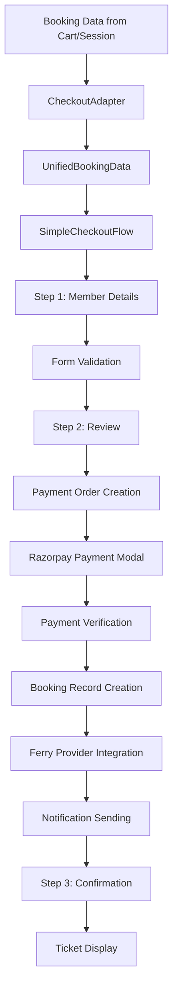

# Checkout Process System Documentation

## 1. Module Overview
- **Module Name**: Checkout Process System
- **Purpose**: Provides a unified, multi-booking-type checkout experience for activities, ferries, and boats. Handles passenger details collection, payment processing via Razorpay, booking confirmation, and post-booking notifications across all booking types.
- **Scope**: 
  - Unified checkout flow for activity, ferry, and boat bookings
  - Multi-step form with validation and error handling
  - Razorpay payment gateway integration with signature verification
  - Booking record creation in Payload CMS
  - Ferry provider booking integration with timeout handling
  - Email and WhatsApp notification system
  - Booking confirmation and ticket generation

## 2. Architecture Overview

### 2.1 High-Level Flow
```
Cart/Booking Session → Checkout Adapter → Passenger Details → Review → Payment → Booking Creation → Provider Integration → Confirmation → Notifications
```

### 2.2 Core Components
- **Entry Points**: 
  - `/checkout?type=activity` - Activity checkout flow
  - `/checkout?type=ferry` - Ferry booking checkout
  - `/checkout?type=boat` - Boat booking checkout
  - `/checkout?type=mixed` - Mixed booking types

- **Main Components**:
  - `CheckoutAdapter` - Unified interface for different booking types
  - `SimpleCheckoutFlow` - Main checkout orchestrator with step navigation
  - `SimpleMemberDetailsStep` - Passenger information collection
  - `SimpleReviewStep` - Booking review and payment initiation
  - `ConfirmationStep` - Success confirmation and ticket display

- **Supporting Components**:
  - `SimpleCheckoutStore` - Zustand store for form state and navigation
  - `CheckoutSchemas` - Zod validation schemas for form data
  - `PaymentVerification` - Razorpay signature verification and booking creation
  - `NotificationManager` - Email and WhatsApp notification system

- **Services**:
  - `CheckoutAdapter` - Booking data normalization across types
  - `RazorpayService` - Payment order creation and verification
  - `FerryBookingService` - Ferry provider integration
  - `NotificationService` - Multi-channel notification delivery

- **State Management**:
  - `SimpleCheckoutStore` - Form data, navigation, and UI state
  - React Query integration for server state
  - Booking session persistence with expiration

### 2.3 Data Flow


## 3. Technical Stack

### 3.1 Frontend Dependencies
```json
{
  "react": "^18.x",
  "next.js": "^14.x",
  "zustand": "^4.x",
  "react-hook-form": "^7.x",
  "zod": "^3.x",
  "@hookform/resolvers": "^3.x",
  "lucide-react": "^0.x",
  "razorpay": "^2.x (client SDK)"
}
```

### 3.2 Backend Dependencies
```json
{
  "razorpay": "^2.x (server SDK)",
  "crypto": "node built-in",
  "payload": "^2.x",
  "uuid": "^9.x"
}
```

### 3.3 External Services
- **Razorpay Payment Gateway**: Order creation, payment processing, webhook handling
- **Ferry Operators**: Sealink, Makruzz, Green Ocean booking APIs
- **Email Service**: Booking confirmation and ticket delivery
- **WhatsApp API**: Real-time booking notifications
- **Payload CMS**: Booking and payment record storage

### 3.4 State Management Pattern
- **Store Type**: Simplified Zustand store for form state only
- **State Shape**: 
  ```typescript
  interface SimpleCheckoutState {
    currentStep: number; // 1=Details, 2=Review, 3=Confirmation
    formData: CheckoutFormData | null;
    isLoading: boolean;
    error: string | null;
    bookingConfirmation: BookingConfirmation | null;
  }
  ```
- **State Updates**: Form state via Zustand, business logic via CheckoutAdapter

## 4. Component Hierarchy
```
CheckoutModule/
├── pages/
│   └── (frontend)/checkout/
│       ├── page.tsx (Main checkout page with adapter integration)
│       ├── page.module.css
│       ├── components/
│       │   ├── SimpleCheckoutFlow/
│       │   │   ├── index.tsx (Step orchestrator)
│       │   │   └── SimpleCheckoutFlow.module.css
│       │   ├── SimpleMemberDetailsStep/
│       │   │   ├── index.tsx (Passenger details form)
│       │   │   └── SimpleMemberDetailsStep.module.css
│       │   ├── SimpleReviewStep/
│       │   │   ├── index.tsx (Review and payment)
│       │   │   └── SimpleReviewStep.module.css
│       │   └── ConfirmationStep/
│       │       ├── index.tsx (Success and tickets)
│       │       └── ConfirmationStep.module.css
│       └── schemas/
│           └── checkoutSchemas.ts (Zod validation schemas)
├── store/
│   └── SimpleCheckoutStore.ts (Form state management)
├── utils/
│   └── CheckoutAdapter.ts (Booking data unification)
├── services/
│   └── notifications/
│       ├── NotificationManager.ts
│       └── notificationService.ts
└── app/
    └── api/payments/
        ├── create-order/route.ts (Razorpay order creation)
        ├── verify/route.ts (Payment verification & booking)
        └── webhook/route.ts (Payment status updates)
```

## 5. Data Models & Types

### 5.1 Core Types
```typescript
interface UnifiedBookingData {
  type: "activity" | "ferry" | "boat" | "mixed";
  items: UnifiedBookingItem[];
  totalPassengers: number;
  totalPrice: number;
  requirements: PassengerRequirements;
}

interface UnifiedBookingItem {
  id: string;
  type: "activity" | "ferry" | "boat";
  title: string;
  passengers: {
    adults: number;
    children: number;
    infants: number;
  };
  price: number;
  date: string;
  time?: string;
  location?: string | Location | Location[];
  // Type-specific fields
  activity?: Activity;
  ferry?: UnifiedFerryResult;
  boat?: Boat;
  searchParams?: ActivitySearchParams | BoatSearchParams;
  selectedClass?: FerryClass;
  selectedSeats?: string[];
}

interface CheckoutFormData {
  members: MemberDetails[];
  termsAccepted: boolean;
}

interface MemberDetails {
  id: string;
  fullName: string;
  age: number;
  gender: "Male" | "Female" | "Other" | "";
  nationality: string;
  passportNumber: string;
  whatsappNumber?: string;
  email?: string;
  isPrimary: boolean;
  selectedBookings: number[]; // Which bookings this member is assigned to
}

interface BookingConfirmation {
  bookingId: string;
  confirmationNumber: string;
  bookingDate: string;
  status: "confirmed" | "pending" | "failed";
  paymentStatus: "paid" | "pending" | "failed";
}
```

### 5.2 API Contracts
```typescript
// POST /api/payments/create-order
interface CreateOrderRequest {
  amount: number; // required
  currency?: string; // default "INR"
  receipt?: string;
  bookingData: PaymentData;
}

interface CreateOrderResponse {
  success: boolean;
  order: {
    id: string;
    amount: number;
    currency: string;
    receipt: string;
  };
}

// POST /api/payments/verify
interface VerifyPaymentRequest {
  razorpay_order_id: string;
  razorpay_payment_id: string;
  razorpay_signature: string;
  bookingData: PaymentData;
  sessionId?: string;
}

interface VerifyPaymentResponse {
  success: boolean;
  booking: {
    bookingId: string;
    confirmationNumber: string;
  };
  payment: {
    transactionId: string;
    status: string;
  };
}
```

## 6. Business Logic & Rules

### 6.1 Checkout Flow Logic
- **Step Navigation**: Linear progression with ability to go back
- **Data Persistence**: Form data persisted in Zustand store across steps
- **Validation**: Progressive validation at each step with Zod schemas
- **Error Handling**: Graceful error recovery with user-friendly messages
- **Timeout Management**: 45-second timeout for ferry provider bookings

### 6.2 Payment Processing Rules
- **Order Creation**: Razorpay order created before payment modal
- **Signature Verification**: HMAC SHA256 signature validation
- **Booking Creation**: Atomic booking record creation in Payload CMS
- **Provider Integration**: Ferry bookings processed with external operators
- **Notification Sending**: Email and WhatsApp notifications on success

### 6.3 Validation Rules
```typescript
// Member validation
const memberSchema = z.object({
  fullName: z.string().min(2).max(100).regex(/^[a-zA-Z\s'-]+$/),
  age: z.coerce.number().int().min(1).max(120),
  gender: z.enum(["Male", "Female", "Other"]),
  nationality: z.string().min(1),
  passportNumber: z.string().min(6).max(12).regex(/^[A-Za-z0-9]{6,12}$/),
  whatsappNumber: z.string().regex(/^\+?[0-9\s\-\(\)]{8,20}$/).optional(),
  email: z.string().email().optional(),
});

// Primary member requires contact fields
const primaryMemberSchema = memberSchema.extend({
  whatsappNumber: z.string().min(1).regex(/^\+?[0-9\s\-\(\)]{8,20}$/),
  email: z.string().min(1).email(),
});
```

### 6.4 Edge Cases
- **Payment Success, Booking Failure**: Payment recorded, booking marked as pending
- **Ferry Provider Timeout**: Booking confirmed, provider booking marked as processing
- **Network Failures**: Retry logic with exponential backoff
- **Invalid Booking Data**: Redirect to appropriate booking page
- **Session Expiry**: Clear state and redirect with error message

## 7. Error Handling

### 7.1 Error Types
- **Validation Errors**: Form field validation failures with specific messages
- **Payment Errors**: Razorpay payment failures, signature verification errors
- **Booking Creation Errors**: Database failures, data integrity issues
- **Provider Integration Errors**: Ferry operator API failures, timeouts
- **Network Errors**: Connection failures, timeout errors

### 7.2 Error Recovery
- **Form Validation**: Real-time validation with field-specific error messages
- **Payment Failures**: Clear error messages with retry options
- **Booking Failures**: Fallback to manual booking process
- **Provider Timeouts**: Booking confirmed with pending provider status
- **Network Issues**: Retry mechanisms with exponential backoff

### 7.3 Error Communication
```typescript
// Error state management
interface ErrorState {
  type: "validation" | "payment" | "booking" | "network";
  message: string;
  field?: string; // For validation errors
  retryable: boolean;
  action?: "retry" | "contact_support" | "go_back";
}
```

## 8. Performance Considerations

### 8.1 Optimization Strategies
- **Form State Management**: Minimal Zustand store for UI state only
- **Data Normalization**: CheckoutAdapter eliminates complex state synchronization
- **Progressive Loading**: Step-by-step component loading
- **Payment SDK**: Dynamic Razorpay SDK loading only when needed
- **Validation**: Client-side validation with Zod for immediate feedback

### 8.2 Bundle Impact
- **Checkout Module**: ~45KB gzipped including all steps
- **Razorpay SDK**: ~25KB loaded dynamically
- **Form Libraries**: React Hook Form + Zod ~15KB combined
- **Icons**: Lucide React icons tree-shaken

### 8.3 Performance Metrics
- **Time to Interactive**: <2s for checkout page load
- **Form Validation**: <100ms response time
- **Payment Processing**: <5s from click to Razorpay modal
- **Booking Creation**: <3s for simple bookings, <45s for ferry bookings

## 9. Integration Points

### 9.1 Internal Integrations
- **Activity Store**: Cart data via CheckoutAdapter
- **Ferry Store**: Booking session data integration
- **Boat Store**: Cart and selection data
- **Payload CMS**: Booking and payment record storage
- **Notification System**: Multi-channel confirmation delivery

### 9.2 External Integrations
- **Razorpay Payment Gateway**: 
  - Order creation API
  - Payment verification webhooks
  - Refund processing (future)
- **Ferry Operators**: 
  - Sealink booking API with timeout handling
  - Makruzz session-based booking
  - Green Ocean hash-authenticated booking
- **Email Service**: SMTP-based booking confirmations
- **WhatsApp API**: Real-time booking notifications

## 10. Testing Strategy

### 10.1 Unit Tests
- **CheckoutAdapter**: Booking data normalization across types
- **Validation Schemas**: Zod schema validation edge cases
- **Form Components**: React Hook Form integration and validation
- **Payment Verification**: Razorpay signature verification logic

### 10.2 Integration Tests
- **Checkout Flow**: End-to-end step navigation and data persistence
- **Payment Processing**: Razorpay integration with mock payments
- **Booking Creation**: Payload CMS integration with test data
- **Provider Integration**: Ferry booking service with mocked APIs

### 10.3 E2E Tests
- **Complete Checkout**: Activity booking from cart to confirmation
- **Ferry Booking**: Ferry selection to provider booking completion
- **Error Scenarios**: Payment failures, network issues, provider timeouts
- **Multi-booking**: Mixed booking types in single checkout

## 11. Security Considerations

### 11.1 Payment Security
- **Signature Verification**: HMAC SHA256 verification of Razorpay signatures
- **Environment Variables**: Secure storage of Razorpay keys
- **HTTPS Only**: All payment communication over secure connections
- **PCI Compliance**: No card data stored, handled by Razorpay

### 11.2 Data Protection
- **Input Sanitization**: Zod schema validation and sanitization
- **Passenger Data**: Encrypted storage in Payload CMS
- **Session Security**: Secure session management with expiration
- **API Security**: Rate limiting and authentication on payment endpoints

### 11.3 Sensitive Data Handling
```typescript
// Environment variables required
RAZORPAY_KEY_ID=rzp_live_xxx
RAZORPAY_KEY_SECRET=xxx
NEXT_PUBLIC_RAZORPAY_KEY_ID=rzp_live_xxx

// Data encryption in transit
- All API calls use HTTPS
- Razorpay handles PCI compliance
- Passenger data encrypted in database
```

## 12. Deployment & Configuration

### 12.1 Environment Variables
```env
# Razorpay Configuration
RAZORPAY_KEY_ID=rzp_live_xxx
RAZORPAY_KEY_SECRET=xxx
NEXT_PUBLIC_RAZORPAY_KEY_ID=rzp_live_xxx

# Application Configuration
NEXT_PUBLIC_SITE_URL=https://andamanexcursion.com
PAYLOAD_SECRET=your-payload-secret
DATABASE_URI=mongodb://localhost:27017/andaman

# Ferry Provider Configuration (inherited)
SEALINK_API_URL=https://api.sealink.in/
MAKRUZZ_API_URL=https://api.makruzz.com/
GREEN_OCEAN_API_URL=https://api.greenocean.in/

# Notification Configuration
SMTP_HOST=smtp.gmail.com
SMTP_PORT=587
WHATSAPP_API_URL=https://api.whatsapp.com/
```

### 12.2 Build Configuration
- **API Routes**: Server-side payment processing endpoints
- **Static Assets**: Checkout form components and styles
- **Environment Validation**: Startup checks for Razorpay credentials
- **Security Headers**: CSP configuration for Razorpay domain

## 13. Monitoring & Analytics

### 13.1 Key Metrics
- **Checkout Conversion Rate**: 85%+ completion rate from step 1 to payment
- **Payment Success Rate**: 95%+ successful payment processing
- **Booking Creation Success**: 98%+ successful booking record creation
- **Ferry Provider Success**: 90%+ successful ferry provider bookings
- **Average Checkout Time**: <5 minutes from start to confirmation

### 13.2 Logging & Monitoring
- **Payment Processing**: Detailed logs for order creation and verification
- **Booking Creation**: Audit trail for all booking record operations
- **Provider Integration**: Ferry booking success/failure tracking
- **Error Tracking**: Comprehensive error logging with context
- **Performance Monitoring**: Checkout step completion times

### 13.3 Business Analytics
```typescript
// Tracked events
- checkout_started: { booking_type, total_amount, passenger_count }
- step_completed: { step_number, time_taken, booking_type }
- payment_initiated: { amount, payment_method, booking_type }
- payment_completed: { transaction_id, amount, booking_type }
- booking_confirmed: { booking_id, confirmation_number, booking_type }
- provider_booking_status: { operator, success, error_type }
```

## 14. Known Issues & Technical Debt

### 14.1 Current Issues
- **Ferry Provider Reliability**: Occasional API instability requires retry logic
- **Session Management**: In-memory session storage needs database persistence
- **Mobile UX**: Payment modal needs mobile optimization
- **Error Messages**: Some error messages could be more user-friendly

### 14.2 Technical Debt
- **State Management**: Consider moving to React Query for all server state
- **Validation**: Consolidate validation schemas across booking types
- **Testing**: Need comprehensive E2E test coverage
- **Documentation**: API documentation needs updates for new endpoints

### 14.3 Performance Improvements Needed
- **Bundle Splitting**: Further optimize checkout bundle size
- **Caching**: Implement Redis for session and booking data caching
- **Database**: Optimize Payload CMS queries for booking creation
- **Monitoring**: Add real-time performance monitoring

## 15. Future Enhancements

### 15.1 Planned Features
- **Multi-Currency Support**: USD, EUR payment options for international customers
- **Installment Payments**: EMI options for high-value bookings
- **Guest Checkout**: Checkout without account creation
- **Booking Modifications**: Post-booking changes and cancellations
- **Loyalty Integration**: Points earning and redemption during checkout

### 15.2 Technical Improvements
- **Real-time Updates**: WebSocket integration for live booking status
- **Offline Support**: Progressive Web App with offline checkout capability
- **A/B Testing**: Checkout flow optimization experiments
- **Advanced Analytics**: Funnel analysis and conversion optimization
- **API Gateway**: Centralized API management for all integrations

### 15.3 Integration Enhancements
- **Payment Methods**: UPI, wallet, and BNPL integration
- **Booking Engines**: Additional ferry and activity provider integrations
- **CRM Integration**: Customer data synchronization
- **Accounting Systems**: Automated financial record keeping

---

## Quick Reference

### Key Files
- **Main Checkout**: `src/app/(frontend)/checkout/page.tsx`
- **Checkout Adapter**: `src/utils/CheckoutAdapter.ts`
- **Form Store**: `src/store/SimpleCheckoutStore.ts`
- **Payment Creation**: `src/app/api/payments/create-order/route.ts`
- **Payment Verification**: `src/app/api/payments/verify/route.ts`

### Common Operations
```typescript
// Initialize checkout with booking data
const { bookingType, bookingData, requirements } = useCheckoutAdapterRQ(searchParams);

// Navigate between steps
const { currentStep, nextStep, prevStep, setCurrentStep } = useSimpleCheckoutStore();

// Handle form submission
const { updateFormData, formData } = useSimpleCheckoutStore();
updateFormData(checkoutFormData);

// Process payment
const orderResponse = await fetch("/api/payments/create-order", {
  method: "POST",
  body: JSON.stringify({ amount, bookingData })
});

// Verify payment and create booking
const verifyResponse = await fetch("/api/payments/verify", {
  method: "POST",
  body: JSON.stringify({ razorpay_order_id, razorpay_payment_id, razorpay_signature, bookingData })
});
```

### Debug Commands
```bash
# Monitor checkout state
useSimpleCheckoutStore.getState()

# Check booking data adapter
CheckoutAdapter.getUnifiedBookingData("activity")

# View payment logs
tail -f logs/payment.log | grep "razorpay"

# Monitor booking creation
curl -X GET "/api/bookings?status=pending"
```

### Checkout Flow States
- **Step 1**: Member details collection with validation
- **Step 2**: Booking review and payment initiation
- **Step 3**: Confirmation display with ticket information
- **Error States**: Validation errors, payment failures, booking issues
- **Loading States**: Form submission, payment processing, booking creation

### Payment Integration Notes
- **Razorpay Test Mode**: Use test keys for development environment
- **Signature Verification**: Critical for payment security - never skip
- **Webhook Handling**: Async payment status updates for reliability
- **Error Handling**: Always provide clear user feedback for payment issues
- **Timeout Management**: 45-second limit for ferry provider integrations
