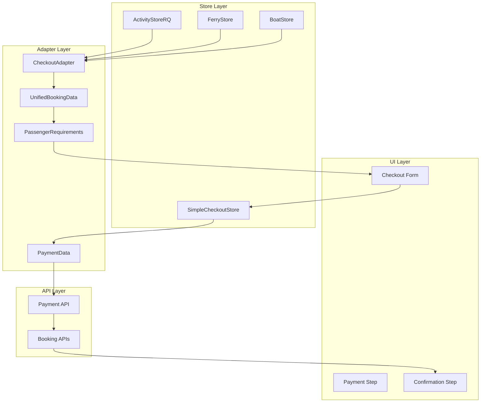
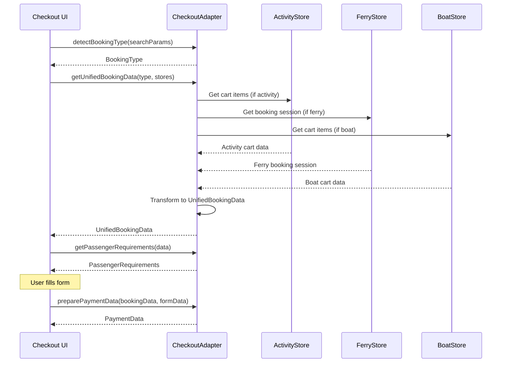
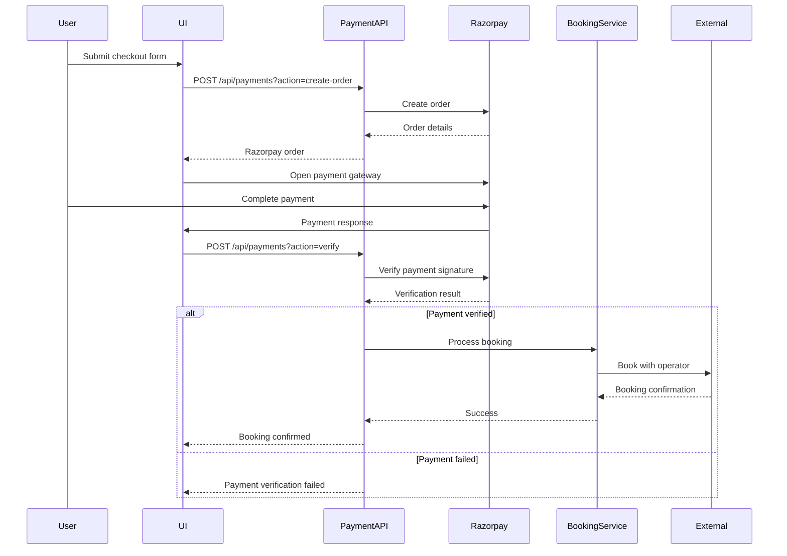
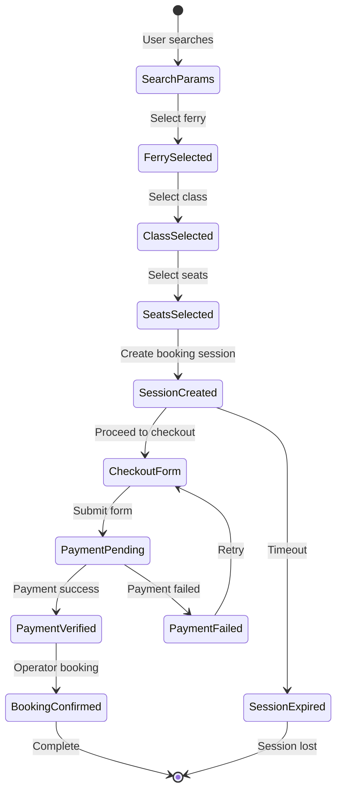
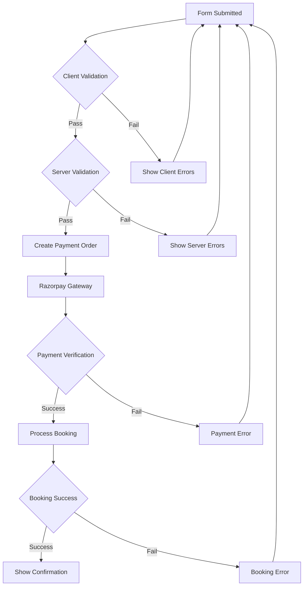
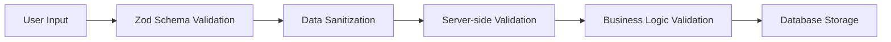

# Unified Checkout System Flow Documentation

## Overview

The unified checkout system handles multiple booking types (activities, ferries, boats) through a single, consistent interface. The CheckoutAdapter serves as the central orchestrator that normalizes different booking types.

## 1. Checkout Flow Diagram

```mermaid
flowchart TD
    Start([User initiates checkout]) --> DetectType{Detect booking type}
    
    DetectType -->|activity| ActivityData[Get Activity Data]
    DetectType -->|ferry| FerryData[Get Ferry Data]
    DetectType -->|boat| BoatData[Get Boat Data]
    DetectType -->|mixed| MixedData[Get Mixed Data]
    
    ActivityData --> Adapter[CheckoutAdapter.getUnifiedBookingData()]
    FerryData --> Adapter
    BoatData --> Adapter
    MixedData --> Adapter
    
    Adapter --> UnifiedData[UnifiedBookingData]
    UnifiedData --> Requirements[Calculate Passenger Requirements]
    
    Requirements --> Form[Render SimpleMemberDetailsStep]
    Form --> Validation{Form Valid?}
    
    Validation -->|No| Form
    Validation -->|Yes| PaymentData[Prepare Payment Data]
    
    PaymentData --> RazorpayOrder[Create Razorpay Order]
    RazorpayOrder --> PaymentGateway[Payment Gateway]
    
    PaymentGateway --> PaymentSuccess{Payment Success?}
    PaymentSuccess -->|No| PaymentError[Payment Failed]
    PaymentSuccess -->|Yes| VerifyPayment[Verify Payment]
    
    VerifyPayment --> BookingAPI{Booking Type}
    BookingAPI -->|ferry| FerryBooking[Ferry Booking Service]
    BookingAPI -->|activity| ActivityBooking[Activity Booking Service]
    BookingAPI -->|boat| BoatBooking[Boat Booking Service]
    
    FerryBooking --> Confirmation[Booking Confirmation]
    ActivityBooking --> Confirmation
    BoatBooking --> Confirmation
    
    Confirmation --> Success([Booking Complete])
    PaymentError --> Failure([Booking Failed])
```

## 2. Data Flow Architecture



## 3. CheckoutAdapter Deep Dive

### 3.1 Core Responsibilities

```typescript
class CheckoutAdapter {
  // 1. Type Detection
  static detectBookingType(searchParams: URLSearchParams): BookingType;
  
  // 2. Data Normalization
  static getUnifiedBookingData(type: BookingType, stores: StoreInstances): UnifiedBookingData;
  
  // 3. Requirement Calculation
  static getPassengerRequirements(data: UnifiedBookingData): PassengerRequirements;
  
  // 4. Payment Preparation
  static preparePaymentData(bookingData: UnifiedBookingData, formData: CheckoutFormData): PaymentData;
}
```

### 3.2 Data Transformation Process



## 4. Form Schema Evolution

### 4.1 Current Schema (SimpleMemberDetailsStep)

```typescript
const memberSchema = z.object({
  fullName: z.string().min(2).max(100),
  age: z.coerce.number().int().min(1).max(120),
  gender: z.enum(["Male", "Female", "Other"]),
  nationality: z.string().min(1),
  passportNumber: z.string().min(6).max(12).transform(val => val.toUpperCase()),
  whatsappNumber: z.string().optional(),
  phoneCountryCode: z.string().optional(), // NEW: Country code (+91, +1, etc.)
  phoneCountry: z.string().optional(),     // NEW: Country name (India, USA, etc.)
  email: z.string().email().optional(),
  selectedBookings: z.array(z.number()).min(1), // Links to booking items
});

const formSchema = z.object({
  members: z.array(memberSchema).min(1),
  termsAccepted: z.boolean().refine(val => val === true),
});
```

### 4.2 Schema Comparison: Old vs New

| Feature | Old Schema (checkoutSchemas.ts) | New Schema (SimpleMemberDetailsStep) |
|---------|----------------------------------|-------------------------------------|
| **Purpose** | Activity-specific booking | Unified booking (all types) |
| **Assignment** | `selectedActivities: number[]` | `selectedBookings: number[]` |
| **Contact Fields** | Required for primary only | Optional, validated at form level |
| **Phone Support** | Basic validation | Enhanced with country codes |
| **Validation** | Complex activity-specific rules | Simplified, flexible validation |
| **Usage** | Not used (commented out) | Active in production |

## 5. Payment Integration Flow



## 6. Ferry-Specific Booking Flow

### 6.1 Ferry Data Structure in Checkout

```typescript
interface FerryCheckoutData {
  id: string; // sessionId (e.g., "ferry_1757192537130_8wcph55sc")
  type: "ferry";
  title: string; // "Sealink - Port Blair to Havelock"
  ferryId: string; // CRITICAL: "sealink-68afe5056bbf62f3db17a8c8"
  ferry: UnifiedFerryResult;
  selectedClass: FerryClass;
  selectedSeats: string[];
  passengers: { adults: number; children: number; infants: number };
  price: number;
  date: string;
  time: string;
}
```

### 6.2 Ferry Booking Session Management



## 7. Error Handling & Validation

### 7.1 Form Validation Flow



### 7.2 Critical Error Points

1. **Ferry ID Mapping**: Ensuring `ferryId` is correctly passed from session to payment
2. **Cache Misses**: Handling empty trip data cache during booking
3. **Payment Verification**: Validating Razorpay signatures
4. **Operator API Failures**: Handling external API timeouts/errors
5. **Session Expiry**: Managing booking session timeouts

## 8. Performance Optimizations

### 8.1 React Query Integration

```typescript
// Ferry search with caching
const { data: ferries, isLoading } = useFerrySearch(searchParams, {
  staleTime: 5 * 60 * 1000, // 5 minutes
  cacheTime: 10 * 60 * 1000, // 10 minutes
  refetchOnWindowFocus: false,
});

// Seat layout with real-time updates
const { data: seatLayout } = useSeatLayout(ferryId, {
  refetchInterval: 30 * 1000, // 30 seconds
  enabled: !!ferryId,
});
```

### 8.2 State Management Optimization

```typescript
// Zustand with Immer for immutable updates
export const useFerryStore = create<FerryStore>()(
  immer((set, get) => ({
    setSearchParams: (params) => {
      set((state) => {
        state.searchParams = params;
        // Clear dependent state
        state.selectedFerry = null;
        state.selectedClass = null;
        state.selectedSeats = [];
      });
    },
  }))
);
```

## 9. Security Considerations

### 9.1 Data Validation Pipeline



### 9.2 Payment Security

1. **Razorpay Integration**: Secure payment gateway with signature verification
2. **API Rate Limiting**: Prevent abuse with IP-based rate limiting
3. **Session Management**: Secure booking session handling with expiry
4. **Data Encryption**: Sensitive data encrypted in transit and at rest

## 10. Monitoring & Analytics

### 10.1 Key Metrics to Track

- **Conversion Rate**: Search → Booking completion
- **Drop-off Points**: Where users abandon the flow
- **Payment Success Rate**: Payment gateway performance
- **Booking Success Rate**: Operator API reliability
- **Form Validation Errors**: Common user input issues

### 10.2 Error Tracking

```typescript
// Error boundary for crash protection
<FerrySearchErrorBoundary>
  <CheckoutFlow />
</FerrySearchErrorBoundary>

// Structured error logging
console.error('Checkout error:', {
  step: 'payment-verification',
  bookingType: 'ferry',
  ferryId: 'sealink-123',
  error: error.message,
  timestamp: new Date().toISOString()
});
```

## 11. Future Improvements

### 11.1 Identified Redundancies

1. **Duplicate Country/Gender Lists**: Move to shared constants
2. **Schema Duplication**: Consolidate validation schemas
3. **Store State Overlap**: Reduce redundant state between stores
4. **API Response Caching**: Implement smarter caching strategies

### 11.2 Architecture Improvements

1. **Event-Driven Architecture**: Use events for booking state changes
2. **Microservices**: Separate booking services by type
3. **Database Optimization**: Implement proper connection pooling
4. **Real-time Updates**: WebSocket integration for live seat updates
5. **Progressive Web App**: Offline booking capabilities

---

*This documentation provides a comprehensive view of the unified checkout system. Use this to identify optimization opportunities and architectural improvements.*
