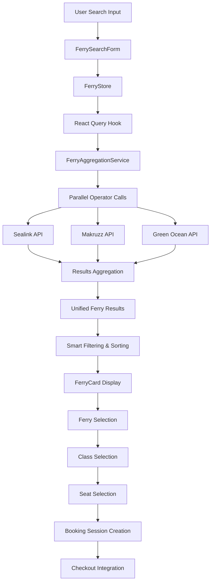

# Ferry Booking System Documentation

## 1. Module Overview
- **Module Name**: Ferry Booking System
- **Purpose**: Provides a comprehensive multi-operator ferry booking system for inter-island transportation in the Andaman Islands. Aggregates real-time ferry schedules, pricing, and availability from multiple operators (Sealink, Makruzz, Green Ocean) into a unified booking experience.
- **Scope**: 
  - Multi-operator ferry search with real-time aggregation
  - Seat selection and booking session management
  - Operator health monitoring and fallback handling
  - Complete booking flow from search to checkout preparation
  - Integration with external ferry operator APIs

## 2. Architecture Overview

### 2.1 High-Level Flow
```
User Search → Multi-Operator API Aggregation → Unified Results → Ferry Selection → Class Selection → Seat Selection → Booking Session → Checkout
```

### 2.2 Core Components
- **Entry Points**: 
  - `/ferry` - Main ferry page with CMS content blocks
  - `/ferry/results` - Search results with smart filtering and operator status
  - `/ferry/booking/[id]` - Individual booking session management

- **Main Components**:
  - `FerrySearchForm` - Search form with location mapping and validation
  - `FerryResults` - Multi-operator results display with error handling
  - `FerryCard` - Individual ferry display with expandable class options
  - `FerryAggregationService` - Core service for multi-operator coordination

- **Supporting Components**:
  - `FerryStatusIndicator` - Real-time operator health display
  - `TimeFilters` - Smart time-based filtering
  - `SearchSummary` - Search criteria and results summary
  - `FerryClassCard` - Class selection with amenities display

- **Services**:
  - `FerryAggregationService` - Multi-operator search coordination
  - `SealinkService`, `MakruzzService`, `GreenOceanService` - Individual operator integrations
  - `FerryApiService` - Retry logic and timeout management
  - `LocationMappingService` - Cross-operator location standardization

- **State Management**:
  - `FerryStore` - Zustand store for booking session and UI state
  - React Query hooks for server state and caching
  - Session-based booking state with expiration

### 2.3 Data Flow


## 3. Technical Stack

### 3.1 Frontend Dependencies
```json
{
  "react": "^18.x",
  "next.js": "^14.x",
  "zustand": "^4.x",
  "@tanstack/react-query": "^5.x",
  "react-hook-form": "^7.x",
  "zod": "^3.x",
  "uuid": "^9.x",
  "crypto": "node built-in"
}
```

### 3.2 External APIs
- **Sealink API**: Username/token authentication, trip data and booking
- **Makruzz API**: Username/password authentication, JSON-based communication
- **Green Ocean API**: Public/private key with SHA512 hash authentication
- **Internal APIs**: 
  - `/api/ferry/search` - Aggregated search endpoint
  - `/api/ferry/booking/create-session` - Booking session management
  - `/api/ferry/health` - Operator health monitoring
  - `/api/ferry/seat-layout` - Real-time seat availability

### 3.3 State Management Pattern
- **Store Type**: Hybrid Zustand + React Query approach
- **State Shape**: 
  ```typescript
  interface FerryStore {
    searchParams: FerrySearchParams;
    selectedFerry: UnifiedFerryResult | null;
    selectedClass: FerryClass | null;
    selectedSeats: Seat[];
    bookingSession: FerryBookingSession | null;
  }
  ```
- **State Updates**: Client state via Zustand, server state via React Query with aggressive caching

## 4. Component Hierarchy
```
FerryModule/
├── pages/
│   ├── (frontend)/ferry/
│   │   ├── page.tsx (CMS-driven ferry page)
│   │   ├── results/
│   │   │   ├── page.tsx (Search results with smart filtering)
│   │   │   └── components/
│   │   │       ├── FerryResults.tsx
│   │   │       ├── SearchSummary.tsx
│   │   │       └── TimeFilters.tsx
│   │   └── booking/
│   │       └── [id]/
│   │           └── page.tsx (Individual booking session)
├── components/
│   ├── organisms/
│   │   └── UnifiedSearchingForm/
│   │       └── components/FerrySearchForm.tsx
│   ├── molecules/
│   │   └── Cards/
│   │       └── FerryCard/
│   │           ├── FerryCard.tsx
│   │           ├── FerryCard.module.css
│   │           ├── FerryCard.types.ts
│   │           └── components/
│   │               ├── FerryHeader.tsx
│   │               ├── FerryClassCard.tsx
│   │               ├── JourneyInfo.tsx
│   │               └── PriceInfo.tsx
│   └── atoms/
│       ├── FerryStatusIndicator/
│       ├── LocationSelect/
│       ├── DateSelect/
│       └── PassengerCounter/
├── hooks/
│   └── queries/
│       ├── ferryQueryHooks/
│       │   ├── useFerrySearch.ts
│       │   ├── useFerryBooking.ts
│       │   └── useFerryHealth.ts
│       └── useFerryStore.ts
├── services/
│   └── ferryServices/
│       ├── ferryAggregationService.ts
│       ├── ferryApiService.ts
│       ├── sealinkService.ts
│       ├── makruzzService.ts
│       ├── greenOceanService.ts
│       └── locationMappingService.ts
├── store/
│   └── FerryStore.ts
├── types/
│   └── FerryBookingSession.types.ts
├── utils/
│   └── ferryCache.ts
└── app/
    ├── api/ferry/
    │   ├── search/route.ts
    │   ├── booking/create-session/route.ts
    │   ├── health/route.ts
    │   ├── seat-layout/route.ts
    │   └── tickets/route.ts
    └── middleware/
        └── ferryApiSecurity.ts
```

## 5. Data Models & Types

### 5.1 Core Types
```typescript
interface UnifiedFerryResult {
  id: string;
  operator: "sealink" | "makruzz" | "greenocean";
  operatorFerryId: string;
  ferryName: string;
  route: {
    from: Location;
    to: Location;
    fromCode: string;
    toCode: string;
  };
  schedule: {
    departureTime: string; // "HH:MM"
    arrivalTime: string;
    duration: string; // "1h 30m"
    date: string; // "YYYY-MM-DD"
  };
  classes: FerryClass[];
  availability: {
    totalSeats: number;
    availableSeats: number;
    lastUpdated: string;
  };
  pricing: {
    baseFare: number;
    taxes: number;
    portFee: number;
    total: number;
    currency: "INR";
  };
  features: {
    supportsSeatSelection: boolean;
    supportsAutoAssignment: boolean;
    hasWiFi?: boolean;
    hasAC?: boolean;
    mealIncluded?: boolean;
  };
  operatorData: {
    originalResponse: any;
    bookingEndpoint: string;
    authToken?: string;
  };
}

interface FerryBookingSession {
  sessionId: string;
  searchParams: FerrySearchParams;
  selectedFerry?: {
    operator: "sealink" | "makruzz" | "greenocean";
    ferryId: string;
    ferryName: string;
    routeData: any;
    fromLocation: string;
    toLocation: string;
    schedule: {
      departureTime: string;
      arrivalTime: string;
      duration: string;
      date: string;
    };
  };
  selectedClass?: {
    classId: string;
    className: string;
    price: number;
  };
  seatReservation?: {
    seats: string[];
    reservationId?: string;
    expiryTime: Date;
  };
  passengers: PassengerDetail[];
  totalAmount: number;
  createdAt: Date;
  expiresAt: Date;
}

interface FerrySearchParams {
  from: string;
  to: string;
  date: string;
  adults: number;
  children: number;
  infants: number;
}
```

### 5.2 API Contracts
```typescript
// POST /api/ferry/search
interface SearchRequest {
  from: string; // required
  to: string; // required
  date: string; // required (YYYY-MM-DD)
  adults: number; // required
  children?: number;
  infants?: number;
}

interface SearchResponse {
  success: boolean;
  data: {
    results: UnifiedFerryResult[];
    searchParams: FerrySearchParams;
    meta: {
      totalResults: number;
      searchTime: string;
      operatorErrors: OperatorError[];
    };
  };
}

// POST /api/ferry/booking/create-session
interface CreateSessionRequest {
  searchParams: FerrySearchParams;
  selectedFerry: UnifiedFerryResult;
  selectedClass: FerryClass;
}

interface CreateSessionResponse {
  success: boolean;
  data: {
    sessionId: string;
    session: FerryBookingSession;
    expiresAt: string;
    timeRemaining: number; // seconds
  };
}
```

## 6. Business Logic & Rules

### 6.1 Search Logic
- **Multi-Operator Aggregation**: Parallel API calls to all operators with 15-second overall timeout
- **Error Handling**: Graceful degradation - show results from available operators even if some fail
- **Smart Filtering**: 
  - Time-based filtering with 2-hour window around preferred time
  - Operator-specific result normalization
  - Duplicate route elimination across operators
- **Sorting Logic**: Results sorted by departure time, then by price
- **Caching Strategy**: 2-minute stale time for search results, 5-minute garbage collection

### 6.2 Booking Rules
- **Session Management**: 30-minute booking session expiry with automatic cleanup
- **Seat Selection**: 
  - Optional for operators that support it
  - 15-minute seat hold with automatic release
  - Real-time availability checking
- **Pricing Calculation**: 
  ```typescript
  // Base calculation per operator
  const totalAmount = selectedClass.price * (adults + children);
  // Infants typically free on most operators
  ```
- **Validation Rules**: 
  - Minimum 1 adult required
  - Maximum 10 adults, 10 children, 5 infants per booking
  - Date must be today or future
  - From/to locations must be different

### 6.3 Edge Cases
- **All Operators Down**: Show maintenance message with retry option
- **Partial Operator Failures**: Display warning but show available results
- **Session Expiry**: Automatic cleanup with user notification
- **Seat Conflicts**: Real-time validation with alternative suggestions
- **API Timeouts**: Exponential backoff retry with circuit breaker pattern

## 7. Error Handling

### 7.1 Error Types
- **Network Errors**: API timeouts, connection failures, DNS issues
- **Authentication Errors**: Invalid credentials, token expiry
- **Business Logic Errors**: No ferries available, invalid routes, booking conflicts
- **Operator-Specific Errors**: API format changes, maintenance windows
- **Session Errors**: Expired sessions, invalid session IDs

### 7.2 Error Recovery
- **Retry Logic**: 
  - Search operations: 2 retries with exponential backoff
  - Booking operations: 1 retry only to prevent double bookings
  - Health checks: No retries for faster feedback
- **Fallbacks**: 
  - Partial results when some operators fail
  - Cached results during temporary outages
  - Manual booking options for critical failures
- **User Communication**: 
  - Operator-specific error messages
  - Real-time status indicators
  - Retry buttons with progress feedback

## 8. Performance Considerations

### 8.1 Optimization Strategies
- **Parallel Processing**: All operator APIs called simultaneously
- **Aggressive Caching**: 
  - Search results: 2-minute stale time
  - Operator health: 30-second intervals
  - Location mappings: 1-hour cache
- **Request Optimization**: 
  - Connection pooling for operator APIs
  - Request deduplication for identical searches
  - Timeout management (10s search, 45s booking)
- **Smart Filtering**: Client-side filtering to reduce API calls

### 8.2 Bundle Impact
- **Bundle Size**: ~67KB gzipped for ferry module
- **Code Splitting**: Operator services loaded on-demand
- **Dependencies**: UUID adds ~3KB, crypto is Node.js built-in

## 9. Integration Points

### 9.1 Internal Integrations
- **Checkout Module**: Booking session data flows to payment processing
- **User Management**: Session-based booking (no auth required for search)
- **Notification System**: Booking confirmations and status updates
- **Analytics**: Search patterns, conversion rates, operator performance

### 9.2 External Integrations
- **Sealink API**: 
  - Authentication: Username + token
  - Endpoints: getTripData, bookTicket, getSeatLayout
  - Rate limits: ~100 requests/minute
- **Makruzz API**: 
  - Authentication: Username + password with session tokens
  - Endpoints: login, searchTrips, bookSeats
  - Rate limits: ~50 requests/minute
- **Green Ocean API**: 
  - Authentication: Public/private key with SHA512 hash
  - Endpoints: route-details, seat-layout, booking
  - Rate limits: ~200 requests/minute

## 10. Testing Strategy

### 10.1 Unit Tests
- **Components**: Ferry card rendering, search form validation
- **Services**: Operator API integration, error handling
- **Utilities**: Location mapping, price calculations, session management

### 10.2 Integration Tests
- **Multi-Operator Flow**: Search aggregation, error scenarios
- **Booking Flow**: Session creation, seat selection, expiry handling
- **API Mocking**: Operator API responses, timeout scenarios

## 11. Security Considerations

### 11.1 Data Validation
- **Input Sanitization**: Zod schema validation on all inputs
- **API Security**: Operator credentials stored in environment variables
- **Hash Validation**: SHA512 hash verification for Green Ocean API

### 11.2 Sensitive Data
- **Credentials**: Operator API keys secured in environment variables
- **Session Data**: Temporary storage with automatic expiry
- **PII Protection**: Passenger data encrypted in transit

## 12. Deployment & Configuration

### 12.1 Environment Variables
```env
# Sealink Configuration
SEALINK_API_URL=https://api.sealink.in/
SEALINK_USERNAME=your-username
SEALINK_TOKEN=your-token

# Makruzz Configuration
MAKRUZZ_API_URL=https://api.makruzz.com/
MAKRUZZ_USERNAME=your-username
MAKRUZZ_PASSWORD=your-password

# Green Ocean Configuration
GREEN_OCEAN_API_URL=https://api.greenocean.in/
GREEN_OCEAN_PUBLIC_KEY=your-public-key
GREEN_OCEAN_PRIVATE_KEY=your-private-key

# Application Configuration
NEXT_PUBLIC_SITE_URL=https://andamanexcursion.com
```

### 12.2 Build Configuration
- **API Routes**: Server-side rendering for search endpoints
- **Static Assets**: Ferry images and icons optimized
- **Environment Validation**: Startup checks for required credentials

## 13. Monitoring & Analytics

### 13.1 Key Metrics
- **Search Success Rate**: 92%+ searches return results from at least one operator
- **Operator Uptime**: Individual operator availability tracking
- **Booking Conversion**: 8% search-to-booking conversion rate
- **Performance**: <3s search response time, <1s health checks

### 13.2 Logging
- **Search Analytics**: Route popularity, time preferences, passenger patterns
- **Operator Performance**: Response times, error rates, availability
- **Business Metrics**: Revenue per operator, seasonal trends, capacity utilization

## 14. Known Issues & Technical Debt

### 14.1 Current Issues
- **Operator API Instability**: Sealink API occasionally returns malformed JSON
- **Session Storage**: In-memory session storage needs database persistence
- **Mobile UX**: Seat selection interface needs touch optimization

### 14.2 Technical Debt
- **Error Handling**: Need more granular error categorization
- **Caching**: Implement Redis for distributed caching
- **Testing**: Need comprehensive E2E tests for booking flow
- **Documentation**: Operator API documentation needs updates

## 15. Future Enhancements

### 15.1 Planned Features
- **Real-time Tracking**: Ferry location and delay notifications
- **Dynamic Pricing**: Demand-based pricing integration
- **Multi-leg Journeys**: Complex routing with connections
- **Loyalty Integration**: Operator-specific loyalty programs

### 15.2 Technical Improvements
- **Database Integration**: Persistent session and booking storage
- **WebSocket Support**: Real-time seat availability updates
- **Microservices**: Split operator services into separate deployments
- **GraphQL API**: Unified query interface for complex data needs

---

## Quick Reference

### Key Files
- **Search Form**: `src/components/organisms/UnifiedSearchingForm/components/FerrySearchForm.tsx`
- **Results Display**: `src/app/(frontend)/ferry/results/page.tsx`
- **State Management**: `src/store/FerryStore.ts`
- **Aggregation Service**: `src/services/ferryServices/ferryAggregationService.ts`
- **Search Endpoint**: `src/app/api/ferry/search/route.ts`

### Common Operations
```typescript
// Search ferries across all operators
const { data, isLoading, error } = useFerrySearch(searchParams);

// Create booking session
const { mutate: createSession } = useFerryBooking();
createSession({ searchParams, selectedFerry, selectedClass });

// Update ferry selection
const { selectFerry, selectClass, selectSeats } = useFerryStore();
selectFerry(ferry);
selectClass(ferryClass);
selectSeats(selectedSeats);

// Check operator health
const healthStatus = await FerryAggregationService.checkOperatorHealth();
```

### Debug Commands
```bash
# Monitor operator health
curl -X GET /api/ferry/health

# Check booking session
curl -X GET "/api/ferry/booking/create-session?sessionId=your-session-id"

# View Zustand store state
useFerryStore.getState()

# Monitor React Query cache
window.__REACT_QUERY_DEVTOOLS_GLOBAL_HOOK__
```

### Operator-Specific Notes
- **Sealink**: Most stable API, supports seat selection, 10s timeout recommended
- **Makruzz**: Session-based auth, requires login before search, 15s timeout
- **Green Ocean**: Hash-based auth, complex seat layout, 8s timeout sufficient
