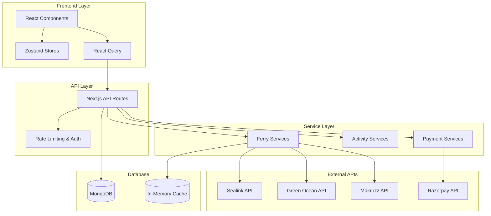
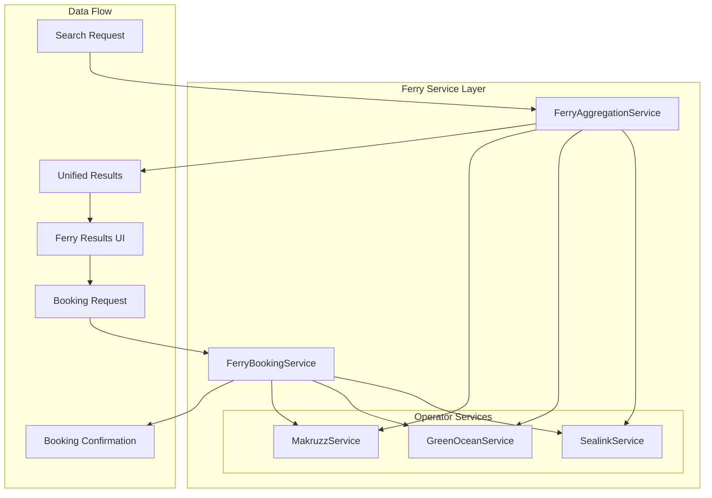
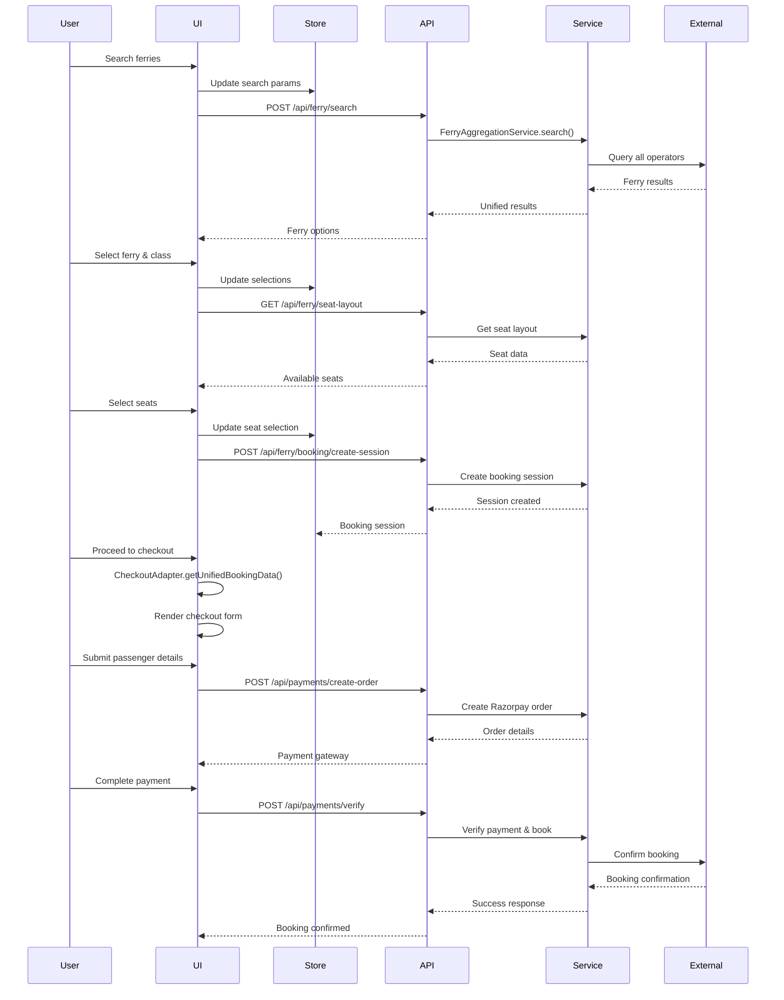

# Ferry Booking System Architecture Documentation

## System Overview

The Andaman Excursion ferry booking system is a unified platform that handles multiple booking types (activities, ferries, boats) through a centralized checkout process. The system integrates with multiple ferry operators (Sealink, Green Ocean, Makruzz) and provides a seamless booking experience.

## 1. High-Level Architecture



## 2. Core Components

### 2.1 State Management Layer

#### FerryStore (Zustand)
```typescript
interface FerryStore {
  // Client-only state
  searchParams: FerrySearchParams;
  selectedFerry: UnifiedFerryResult | null;
  selectedClass: FerryClass | null;
  selectedSeats: Seat[];
  bookingSession: FerryBookingSession | null;
  
  // Actions
  setSearchParams: (params: FerrySearchParams) => void;
  selectFerry: (ferry: UnifiedFerryResult) => void;
  createBookingSession: () => void;
}
```

#### SimpleCheckoutStore
```typescript
interface SimpleCheckoutStore {
  formData: CheckoutFormData | null;
  currentStep: number;
  error: string | null;
  
  updateFormData: (data: CheckoutFormData) => void;
  nextStep: () => void;
  previousStep: () => void;
}
```

### 2.2 CheckoutAdapter (Unified Interface)

The CheckoutAdapter serves as the central orchestrator that normalizes different booking types into a unified format:

```typescript
class CheckoutAdapter {
  // Detects booking type from URL
  static detectBookingType(searchParams: URLSearchParams): BookingType;
  
  // Converts store data to unified format
  static getUnifiedBookingData(type: BookingType, stores: StoreInstances): UnifiedBookingData;
  
  // Prepares payment data
  static preparePaymentData(bookingData: UnifiedBookingData, formData: CheckoutFormData): PaymentData;
}
```

### 2.3 Ferry Services Architecture



## 3. Data Models

### 3.1 Unified Ferry Result
```typescript
interface UnifiedFerryResult {
  id: string;
  operator: 'sealink' | 'greenocean' | 'makruzz';
  operatorFerryId: string;
  ferryName: string;
  route: {
    from: FerryLocation;
    to: FerryLocation;
    fromCode: string;
    toCode: string;
  };
  schedule: {
    departureTime: string;
    arrivalTime: string;
    duration: string;
    date: string;
  };
  classes: FerryClass[];
  availability: {
    totalSeats: number;
    availableSeats: number;
    lastUpdated: string;
  };
  pricing: {
    baseFare: number;
    taxes: number;
    portFee: number;
    total: number;
    currency: 'INR';
  };
}
```

### 3.2 Booking Session
```typescript
interface FerryBookingSession {
  sessionId: string;
  searchParams: FerrySearchParams;
  selectedFerryId: string;
  selectedClassId: string;
  seatReservation?: {
    seats: Seat[];
    expiresAt: Date;
  };
  passengers: PassengerDetail[];
  totalAmount: number;
  status: 'draft' | 'confirmed' | 'cancelled';
  createdAt: Date;
  expiresAt: Date;
}
```

## 4. API Architecture

### 4.1 Ferry API Routes

```
/api/ferry/
├── search/          # Ferry search with aggregation
├── seat-layout/     # Get seat layout for selected ferry
├── booking/
│   ├── create-session/  # Create booking session
│   └── confirm/         # Confirm booking
├── health/          # Health check for all operators
└── tickets/
    └── [pnr]/
        └── download/    # Download ticket PDF
```

### 4.2 Unified Checkout API

```
/api/
├── activities/      # Activity booking (consolidated)
├── contact/         # Contact forms (consolidated)
├── ferry/          # Ferry booking
├── payments/       # Payment processing (consolidated)
└── verify-recaptcha/   # reCAPTCHA verification
```

## 5. Booking Flow Sequence



## 6. Key Design Patterns

### 6.1 Adapter Pattern
- **CheckoutAdapter**: Normalizes different booking types
- **Ferry Services**: Adapts different operator APIs to unified interface

### 6.2 Strategy Pattern
- **Ferry Operators**: Different booking strategies for each operator
- **Payment Processing**: Different payment methods

### 6.3 Observer Pattern
- **React Query**: Automatic cache invalidation and refetching
- **Zustand**: State change notifications

### 6.4 Factory Pattern
- **Ferry Service Factory**: Creates appropriate service based on operator
- **Booking Session Factory**: Creates sessions for different booking types

## 7. Error Handling & Resilience

### 7.1 Rate Limiting
```typescript
// API rate limiting (10 requests per minute per IP)
const rateLimiter = new Map<string, { count: number; resetTime: number }>();
```

### 7.2 Circuit Breaker Pattern
- Automatic fallback when operators are down
- Health checks for all external services

### 7.3 Retry Logic
```typescript
// React Query retry configuration
const retryConfig = {
  retry: (failureCount, error) => {
    if (error.status === 429) return false; // Don't retry rate limits
    return failureCount < 3;
  },
  retryDelay: (attemptIndex) => Math.min(1000 * 2 ** attemptIndex, 30000)
};
```

## 8. Performance Optimizations

### 8.1 Caching Strategy
- **Trip Data Cache**: In-memory cache for ferry search results
- **React Query Cache**: Client-side caching with stale-time management
- **Seat Layout Cache**: Cached seat layouts to prevent repeated API calls

### 8.2 Connection Awareness
```typescript
// Disable reactive search when offline
const isOnline = useConnectionStatus();
const shouldSearch = isOnline && debouncedParams;
```

### 8.3 Request Cancellation
```typescript
// Prevent race conditions
const { data, error } = useQuery({
  queryKey: ['ferry-search', params],
  queryFn: ({ signal }) => searchFerries(params, { signal }),
  enabled: !!params.from && !!params.to
});
```

## 9. Security Measures

### 9.1 Authentication
- Token-based authentication for operator APIs
- Request signing for sensitive operations

### 9.2 Data Validation
- Zod schemas for all form inputs
- Server-side validation for all API endpoints

### 9.3 Rate Limiting
- IP-based rate limiting on search endpoints
- Request throttling for booking operations

## 10. Monitoring & Observability

### 10.1 Error Tracking
```typescript
// Error boundary for crash protection
<FerrySearchErrorBoundary>
  <FerrySearchForm />
</FerrySearchErrorBoundary>
```

### 10.2 Performance Monitoring
- React Query DevTools integration
- API response time tracking
- Cache hit/miss ratios

## 11. Deployment Architecture

### 11.1 Vercel Serverless Functions
- Consolidated API routes to stay under 12-function limit
- Action-based routing for related endpoints

### 11.2 Environment Configuration
```typescript
// Environment-specific settings
const config = {
  sealink: {
    apiUrl: process.env.SEALINK_API_URL,
    token: process.env.SEALINK_TOKEN
  },
  greenocean: {
    apiUrl: process.env.GREENOCEAN_API_URL,
    publicKey: process.env.GREENOCEAN_PUBLIC_KEY
  }
};
```

## 12. Future Considerations

### 12.1 Scalability Issues
- Current serverless architecture may not scale for high transaction volume
- Consider migration to traditional server for better state management
- Database connection pooling for high concurrency

### 12.2 Recommended Improvements
1. **Microservices Architecture**: Separate booking services by operator
2. **Event-Driven Architecture**: Use message queues for booking confirmations
3. **Database Optimization**: Implement proper indexing and connection pooling
4. **Caching Layer**: Redis for distributed caching
5. **Load Balancing**: Multiple server instances for high availability

---

*This documentation provides a comprehensive overview of the ferry booking system architecture. For specific implementation details, refer to the individual service documentation files.*
