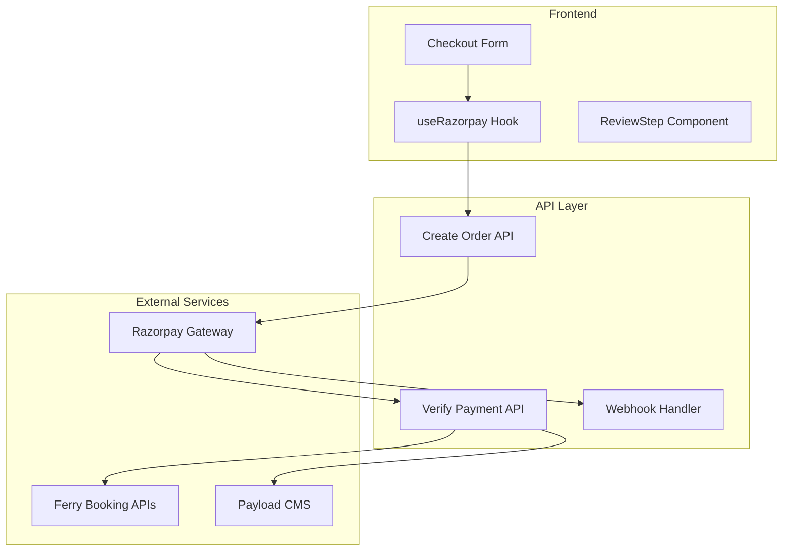

# Razorpay Integration Documentation - Andaman Excursion Platform

## 1. Overview

The Andaman Excursion booking platform integrates Razorpay as the primary payment gateway for processing payments across all booking types (activities, ferries, boats). This document outlines the complete implementation, dependencies, and usage patterns.

### 1.1 Integration Architecture



## 2. Dependencies & Configuration

### 2.1 Package Dependencies

```json
{
  "dependencies": {
    "razorpay": "^2.9.6"
  }
}
```

### 2.2 Environment Variables

```env
# Razorpay Configuration
RAZORPAY_KEY_ID=rzp_live_xxx
RAZORPAY_KEY_SECRET=xxx
NEXT_PUBLIC_RAZORPAY_KEY_ID=rzp_live_xxx
RAZORPAY_WEBHOOK_SECRET=xxx
```

### 2.3 TypeScript Declarations

```typescript
// Global Razorpay interface
declare global {
  interface Window {
    Razorpay: any;
    onPaymentSuccess?: (result: any) => void;
    onPaymentError?: (error: any) => void;
    onPaymentCancel?: () => void;
  }
}
```

## 3. Core Implementation Components

### 3.1 Payment API Routes

#### Create Order API (`/api/payments/create-order/route.ts`)

**Purpose**: Creates Razorpay order before payment initiation

**Key Features**:
- Amount validation and conversion to paise
- IP detection for domestic/international classification
- Order metadata with booking information
- Error handling and logging

**Request Structure**:
```typescript
{
  amount: number,
  currency: "INR",
  receipt: string,
  bookingData: PaymentData
}
```

**Response Structure**:
```typescript
{
  success: boolean,
  order: {
    id: string,
    amount: number,
    currency: string,
    receipt: string
  }
}
```

#### Payment Verification API (`/api/payments/verify/route.ts`)

**Purpose**: Verifies Razorpay signature and processes booking

**Key Features**:
- HMAC SHA256 signature verification
- Payment record creation in Payload CMS
- Ferry booking integration with external APIs
- Edge case handling (payment success + booking failure)
- Notification system integration

**Critical Security Implementation**:
```typescript
const sign = razorpay_order_id + "|" + razorpay_payment_id;
const expectedSign = crypto
  .createHmac("sha256", process.env.RAZORPAY_KEY_SECRET!)
  .update(sign.toString())
  .digest("hex");
```

#### Webhook Handler (`/api/payments/webhook/route.ts`)

**Purpose**: Handles asynchronous payment status updates

**Supported Events**:
- `payment.captured`
- `payment.failed`
- `order.paid`
- `refund.created`

### 3.2 Frontend Integration

#### Direct Integration in ReviewStep Component

**Purpose**: Razorpay integration is implemented directly in the ReviewStep component for better control and unified checkout flow

**Key Implementation**:
- Dynamic Razorpay SDK loading
- Inline payment order creation
- Direct payment verification handling
- Universal checkout for all booking types (ferry, activity, boat)

#### ReviewStep Component Integration

**Payment Flow**:
1. Prepare payment data via CheckoutAdapter
2. Create Razorpay order
3. Load Razorpay SDK dynamically
4. Configure payment options
5. Open Razorpay checkout modal
6. Handle payment response

## 4. Data Models & Types

### 4.1 Payment Data Structure

```typescript
interface PaymentData {
  bookingType: BookingType;
  items: UnifiedBookingItem[];
  members: MemberDetails[];
  totalPrice: number;
  contactDetails: {
    primaryName: string;
    email: string;
    whatsapp: string;
    phoneCountryCode: string;
    phoneCountry: string;
  };
}
```

### 4.2 Razorpay Options Configuration

```typescript
interface RazorpayOptions {
  key: string;
  amount: number;
  currency: string;
  name: string;
  description?: string;
  order_id: string;
  handler: (response: any) => void;
  prefill?: {
    name?: string;
    email?: string;
    contact?: string;
  };
  theme?: { color?: string };
  modal?: { ondismiss?: () => void };
}
```

### 4.3 Payment Record Schema (Payload CMS)

**Collection**: `payments`

**Key Fields**:
- `transactionId`: Auto-generated internal ID
- `razorpayData`: Razorpay-specific transaction data
- `amount`: Payment amount in paise
- `status`: Payment status (pending, success, failed, etc.)
- `customerDetails`: Customer information
- `gatewayResponse`: Complete Razorpay response

## 5. Business Logic & Rules

### 5.1 Payment Processing Flow

1. **Order Creation**: Razorpay order created with booking metadata
2. **Payment Modal**: Razorpay checkout modal opened with prefilled data
3. **Payment Completion**: User completes payment via Razorpay
4. **Signature Verification**: Server verifies payment signature
5. **Booking Processing**: External API bookings processed (ferry operators)
6. **Record Creation**: Payment and booking records stored in CMS
7. **Notifications**: Email/WhatsApp confirmations sent

### 5.2 Edge Case Handling

**Payment Success + Booking Failure**:
- Payment marked as successful
- Booking marked as pending/failed with specific error categorization
- User notified with appropriate next steps
- Manual intervention process triggered

**Error Categories**:
- Seat availability issues
- Wallet balance problems
- Passenger data validation failures
- API timeout scenarios

### 5.3 Security Measures

- **Signature Verification**: All payments verified using HMAC SHA256
- **Environment Variables**: Sensitive keys stored securely
- **HTTPS Only**: All payment communication over secure connections
- **PCI Compliance**: No card data stored locally

## 6. Integration with Booking Systems

### 6.1 Ferry Booking Integration

**Critical Data Flow**:
```typescript
// CheckoutAdapter ensures correct ferry ID mapping
ferryId: selectedFerry?.id, // e.g., "sealink-68afe5056bbf62f3db17a8c8"

// Payment verification extracts actual ferry ID
const actualFerryId = ferryItem.ferryId || ferryItem.ferry?.ferryId;

// Ferry booking service processes with correct ID
await FerryBookingService.bookFerry(actualFerryId, passengerData);
```

**Operator-Specific Handling**:
- **Sealink**: Requires seat selection, auto-selection implemented
- **Makruzz**: Supports foreign passenger fields
- **Green Ocean**: Hash-based authentication

### 6.2 Activity & Boat Bookings

**Simplified Flow**:
- Payment verification creates booking records
- No external API integration required
- Direct confirmation and ticket generation

## 7. Error Handling & Recovery

### 7.1 Payment Failure Scenarios

**Client-Side Errors**:
- SDK loading failures
- Network connectivity issues
- User cancellation

**Server-Side Errors**:
- Signature verification failures
- Database connection issues
- External API timeouts

### 7.2 Recovery Mechanisms

- Automatic retry logic for transient failures
- Manual booking process for critical failures
- Customer support escalation workflows
- Refund processing capabilities

## 8. Monitoring & Analytics

### 8.1 Key Metrics

- Payment success rate (target: 95%+)
- Average payment processing time
- Booking completion rate after payment
- Error categorization and frequency

### 8.2 Logging Strategy

**Payment Creation**:
```typescript
console.log("Razorpay order created:", {
  orderId: order.id,
  amount: order.amount,
  currency: order.currency,
  ip: customerIP
});
```

**Payment Verification**:
```typescript
console.log("Payment verification:", {
  success: true,
  bookingType: bookingData.bookingType,
  ferryId: actualFerryId,
  processingTime: endTime - startTime
});
```

## 9. Testing & Development

### 9.1 Test Environment Setup

```env
# Test Keys
RAZORPAY_KEY_ID=rzp_test_xxx
RAZORPAY_KEY_SECRET=xxx
NEXT_PUBLIC_RAZORPAY_KEY_ID=rzp_test_xxx
```

### 9.2 Test Payment Cards

Razorpay provides test cards for different scenarios:
- Success: 4111 1111 1111 1111
- Failure: 4000 0000 0000 0002
- Network failure: 4000 0000 0000 0119

## 10. Known Issues & Limitations

### 10.1 Current Issues

- **Ferry Provider Reliability**: Occasional API instability
- **Session Management**: In-memory caching limitations
- **Mobile UX**: Payment modal optimization needed
- **Webhook Delays**: Async status updates can be delayed

### 10.2 Architectural Constraints

- **Serverless Limitations**: 45-second timeout for ferry bookings
- **Cold Starts**: Payment processing delays in serverless environment
- **State Management**: Booking sessions lost between function invocations

## 11. Future Enhancements

### 11.1 Planned Features

- Multi-currency support (USD, EUR)
- EMI/installment payment options
- UPI and wallet integrations
- Subscription-based bookings

### 11.2 Technical Improvements

- Real-time payment status updates via WebSockets
- Enhanced retry mechanisms
- Advanced fraud detection
- Payment analytics dashboard

## 12. Quick Reference

### 12.1 Key Files

**Core Payment Files**:
- **Payment APIs**: `/src/app/api/payments/`
  - `/src/app/api/payments/create-order/route.ts` - Order creation
  - `/src/app/api/payments/verify/route.ts` - Payment verification & booking processing
  - `/src/app/api/payments/webhook/route.ts` - Webhook handling
- **Payment Schema**: `/src/app/(payload)/collections/Payments.ts`
- **Checkout Integration**: `/src/app/(frontend)/checkout/components/ReviewStep/index.tsx`

**Supporting Files**:
- **CheckoutAdapter**: `/src/utils/CheckoutAdapter.ts` - Payment data preparation
- **Checkout Store**: `/src/store/CheckoutStore.ts` - State management
- **Ferry Booking Service**: `/src/services/ferryServices/ferryBookingService.ts` - Ferry API integration
- **Notification Manager**: `/src/services/notifications/NotificationManager.ts` - Confirmation emails/SMS

**Frontend Components**:
- **Checkout Page**: `/src/app/(frontend)/checkout/page.tsx`
- **Checkout Flow**: `/src/app/(frontend)/checkout/components/CheckoutFlow/`
- **Confirmation Step**: `/src/app/(frontend)/checkout/components/ConfirmationStep/`
- **Member Details Step**: `/src/app/(frontend)/checkout/components/MemberDetailsStep/`

**Configuration Files**:
- **Environment Variables**: `.env` (payment gateway credentials)
- **Payload Config**: `/src/payload.config.ts` (CMS configuration)

**Removed Files** (No longer in use):
- ~~`/src/hooks/useRazorpay.ts`~~ - Unused hook (commented out)
- ~~`/src/components/atoms/checkout/PaymentButton.tsx`~~ - Unused component (commented out)
- ~~`/src/app/api/payments/archive.ts`~~ - Old consolidated API approach (commented out)

### 12.2 Common Operations

```typescript
// Create payment order
const order = await fetch("/api/payments/create-order", {
  method: "POST",
  body: JSON.stringify({ amount, bookingData })
});

// Verify payment
const verification = await fetch("/api/payments/verify", {
  method: "POST", 
  body: JSON.stringify({
    razorpay_order_id,
    razorpay_payment_id,
    razorpay_signature,
    bookingData
  })
});
```

### 12.3 Debug Commands

```bash
# Monitor payment logs
tail -f logs/payment.log | grep "razorpay"

# Check payment records
curl -X GET "/api/payments?status=pending"

# Webhook testing
curl -X POST "/api/payments/webhook" -H "x-razorpay-signature: xxx"
```

## 13. Complete File Structure

### 13.1 All Payment-Related Files in Codebase

**Core API Routes** (`/src/app/api/payments/`):
- `create-order/route.ts` - Razorpay order creation with IP detection and metadata
- `verify/route.ts` - Payment verification, booking processing, and edge case handling
- `webhook/route.ts` - Asynchronous webhook event handling for payment updates

**Frontend Components** (`/src/app/(frontend)/checkout/`):
- `page.tsx` - Main checkout page with universal booking support
- `components/ReviewStep/index.tsx` - **Primary payment integration** (Razorpay SDK, order creation, verification)
- `components/ConfirmationStep/index.tsx` - Success/failure/pending status handling
- `components/MemberDetailsStep/index.tsx` - Passenger details collection with foreign passenger support
- `components/CheckoutFlow/index.tsx` - Multi-step checkout orchestration

**Business Logic & Services**:
- `/src/utils/CheckoutAdapter.ts` - **Critical**: Payment data preparation for all booking types
- `/src/store/CheckoutStore.ts` - Checkout state management and form data
- `/src/services/ferryServices/ferryBookingService.ts` - Ferry operator API integration (Sealink, Makruzz, Green Ocean)
- `/src/services/notifications/NotificationManager.ts` - Email/SMS confirmation system

**Data Models & Schema**:
- `/src/app/(payload)/collections/Payments.ts` - Payment record schema with Razorpay fields
- `/src/app/(payload)/collections/Bookings.ts` - Booking record schema (referenced by payments)

**Configuration & Environment**:
- `/src/payload.config.ts` - Payload CMS configuration
- `.env` - Environment variables (RAZORPAY_KEY_ID, RAZORPAY_KEY_SECRET, etc.)

**Supporting Components**:
- `/src/app/(frontend)/checkout/components/` - Additional checkout UI components
- `/src/types/` - TypeScript interfaces for payment and booking data

**Inactive/Removed Files**:
- ~~`/src/hooks/useRazorpay.ts`~~ - Commented out (unused hook)
- ~~`/src/components/atoms/checkout/PaymentButton.tsx`~~ - Commented out (unused component)  
- ~~`/src/components/atoms/checkout/PaymentButton.module.css`~~ - Unused styles
- ~~`/src/app/api/payments/archive.ts`~~ - Commented out (old consolidated API)

### 13.2 Payment Flow Architecture

```mermaid
graph TB
    A[User Checkout] --> B[ReviewStep Component]
    B --> C[CheckoutAdapter.preparePaymentData]
    C --> D[/api/payments/create-order]
    D --> E[Razorpay SDK Load]
    E --> F[Razorpay Modal]
    F --> G[/api/payments/verify]
    G --> H[Ferry Booking Service]
    G --> I[Notification Manager]
    G --> J[Payload CMS Records]
    J --> K[ConfirmationStep]
```

---

**Note**: This documentation reflects the current Razorpay-only implementation. The system uses a unified checkout flow that handles all booking types (ferry, activity, boat) through a single payment gateway integration. All payment processing is centralized in the ReviewStep component with comprehensive error handling and edge case management.
