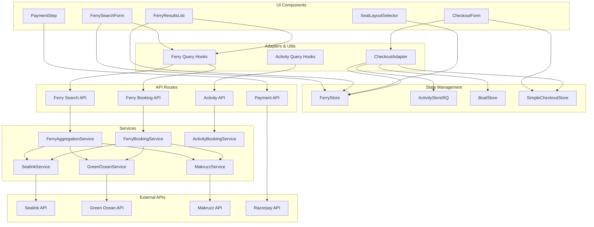
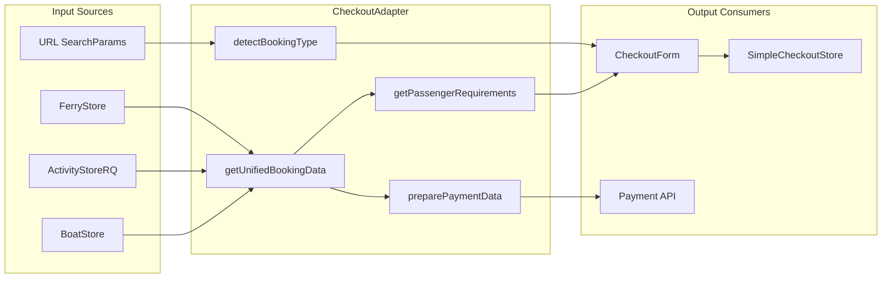
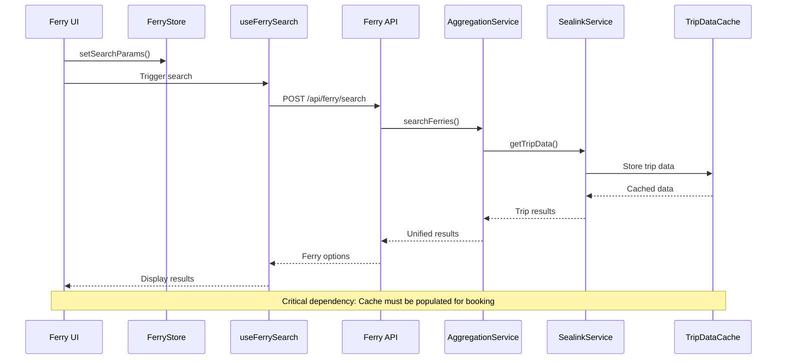

# System Interdependencies & Redundancy Analysis

## Overview

This document analyzes the interdependencies between modules in the Andaman Excursion booking platform and identifies areas for redundancy reduction and optimization.

## 1. Module Dependency Graph



## 2. Critical Interdependencies

### 2.1 CheckoutAdapter Dependencies



### 2.2 Ferry Service Chain



## 3. Identified Redundancies

### 3.1 Schema Definitions

**Problem**: Multiple schema definitions for similar data structures

```typescript
// REDUNDANT: checkoutSchemas.ts (unused)
const baseMemberDetailsSchema = z.object({
  fullName: z.string().min(2, "Name must be at least 2 characters"),
  age: z.coerce.number().int().min(1).max(120),
  // ... more fields
});

// ACTIVE: SimpleMemberDetailsStep/index.tsx
const memberSchema = z.object({
  fullName: z.string().min(2, "Name must be at least 2 characters"),
  age: z.coerce.number().int().min(1).max(120),
  // ... similar fields with slight differences
});
```

**Solution**: Create shared schema definitions

### 3.2 Constants Duplication

**Problem**: Country and gender options duplicated across files

```typescript
// REDUNDANT: checkoutSchemas.ts (commented out)
export const COUNTRIES = [
  { value: "Indian", label: "Indian" },
  // ... 30+ countries
];

// ACTIVE: SimpleMemberDetailsStep/index.tsx
export const COUNTRIES = [
  { value: "Indian", label: "Indian" },
  // ... same 30+ countries
];
```

**Solution**: Move to shared constants file

### 3.3 Store State Overlap

**Problem**: Similar state management patterns across stores

```typescript
// FerryStore
interface FerryStore {
  searchParams: FerrySearchParams;
  selectedFerry: UnifiedFerryResult | null;
  // ...
}

// ActivityStoreRQ
interface ActivityStore {
  searchParams: ActivitySearchParams;
  selectedActivities: Activity[];
  // ...
}

// BoatStore
interface BoatStore {
  searchParams: BoatSearchParams;
  selectedBoat: Boat | null;
  // ...
}
```

**Solution**: Create base store interface with common patterns

### 3.4 API Response Caching

**Problem**: Multiple caching mechanisms with overlapping responsibilities

```typescript
// In-memory cache (FerryServices)
const tripDataCache = new Map();

// React Query cache
const queryClient = new QueryClient({
  defaultOptions: {
    queries: { staleTime: 5 * 60 * 1000 }
  }
});

// Zustand persist middleware
const persistedStore = persist(storeConfig, { name: 'ferry-store' });
```

**Solution**: Consolidate caching strategy

## 4. Optimization Recommendations

### 4.1 Create Shared Schema Library

```typescript
// src/schemas/shared.ts
export const basePassengerSchema = z.object({
  fullName: z.string().min(2).max(100),
  age: z.coerce.number().int().min(1).max(120),
  gender: z.enum(["Male", "Female", "Other"]),
  nationality: z.string().min(1),
  passportNumber: z.string().min(6).max(12).transform(val => val.toUpperCase()),
});

export const contactSchema = z.object({
  whatsappNumber: z.string().optional(),
  phoneCountryCode: z.string().optional(),
  phoneCountry: z.string().optional(),
  email: z.string().email().optional(),
});

// Booking-specific extensions
export const ferryPassengerSchema = basePassengerSchema.extend({
  selectedBookings: z.array(z.number()).min(1),
});

export const activityPassengerSchema = basePassengerSchema.extend({
  selectedActivities: z.array(z.number()).min(1),
});
```

### 4.2 Consolidate Constants

```typescript
// src/constants/index.ts
export const COUNTRIES = [
  { value: "Indian", label: "Indian" },
  { value: "American", label: "American" },
  // ... complete list
];

export const GENDER_OPTIONS = [
  { value: "Male", label: "Male" },
  { value: "Female", label: "Female" },
  { value: "Other", label: "Other" },
];

export const NATIONALITY_MAP = {
  "Saudi": "Saudi Arabia",
  // ... other mappings
};
```

### 4.3 Create Base Store Interface

```typescript
// src/store/base.ts
interface BaseSearchParams {
  date: string;
  adults: number;
  children: number;
  infants?: number;
}

interface BaseStore<TSearchParams extends BaseSearchParams, TItem> {
  searchParams: TSearchParams;
  selectedItems: TItem[];
  isLoading: boolean;
  error: string | null;
  
  setSearchParams: (params: TSearchParams) => void;
  selectItem: (item: TItem) => void;
  clearSelection: () => void;
  reset: () => void;
}

// Extend for specific stores
interface FerryStore extends BaseStore<FerrySearchParams, UnifiedFerryResult> {
  selectedClass: FerryClass | null;
  selectedSeats: Seat[];
  bookingSession: FerryBookingSession | null;
}
```

### 4.4 Unified Caching Strategy

```typescript
// src/utils/cache.ts
class UnifiedCache {
  private memoryCache = new Map();
  private queryClient: QueryClient;
  
  constructor(queryClient: QueryClient) {
    this.queryClient = queryClient;
  }
  
  // Memory cache for temporary data
  setMemory(key: string, data: any, ttl: number) {
    this.memoryCache.set(key, { data, expires: Date.now() + ttl });
  }
  
  // React Query cache for API responses
  setQuery(key: string[], data: any, staleTime: number) {
    this.queryClient.setQueryData(key, data);
  }
  
  // Unified get method
  get(key: string | string[]) {
    if (typeof key === 'string') {
      return this.getMemory(key);
    }
    return this.queryClient.getQueryData(key);
  }
}
```

## 5. Dependency Reduction Strategy

### 5.1 Service Layer Abstraction

```typescript
// Create abstract booking service
abstract class BaseBookingService {
  abstract search(params: any): Promise<any>;
  abstract book(bookingData: any): Promise<any>;
  abstract cancel(bookingId: string): Promise<any>;
}

// Implement for each operator
class SealinkBookingService extends BaseBookingService {
  async search(params: FerrySearchParams) {
    // Sealink-specific implementation
  }
}

// Factory pattern for service creation
class BookingServiceFactory {
  static create(operator: string): BaseBookingService {
    switch (operator) {
      case 'sealink': return new SealinkBookingService();
      case 'greenocean': return new GreenOceanBookingService();
      default: throw new Error(`Unknown operator: ${operator}`);
    }
  }
}
```

### 5.2 Event-Driven Architecture

```typescript
// Event system for loose coupling
class BookingEventBus {
  private listeners = new Map<string, Function[]>();
  
  on(event: string, callback: Function) {
    if (!this.listeners.has(event)) {
      this.listeners.set(event, []);
    }
    this.listeners.get(event)!.push(callback);
  }
  
  emit(event: string, data: any) {
    const callbacks = this.listeners.get(event) || [];
    callbacks.forEach(callback => callback(data));
  }
}

// Usage
const eventBus = new BookingEventBus();

// Ferry service emits events
eventBus.emit('ferry:search:completed', searchResults);
eventBus.emit('ferry:booking:created', bookingSession);

// UI components listen to events
eventBus.on('ferry:booking:created', (session) => {
  // Update UI state
});
```

## 6. Performance Impact Analysis

### 6.1 Current Bottlenecks

1. **Multiple API Calls**: Ferry search calls all operators sequentially
2. **Cache Misses**: Trip data cache cleared between page navigations
3. **State Synchronization**: Multiple stores need manual synchronization
4. **Bundle Size**: Duplicate code increases bundle size

### 6.2 Optimization Impact

| Optimization | Bundle Size Reduction | Performance Gain | Maintenance Improvement |
|--------------|----------------------|------------------|------------------------|
| Shared Schemas | ~5KB | Minimal | High |
| Consolidated Constants | ~2KB | Minimal | Medium |
| Base Store Interface | ~10KB | Medium | High |
| Unified Caching | ~3KB | High | High |
| Service Abstraction | ~15KB | High | Very High |

## 7. Migration Strategy

### 7.1 Phase 1: Low-Risk Consolidation
1. Move constants to shared file
2. Create shared schema library
3. Remove unused checkoutSchemas.ts
4. Update imports across codebase

### 7.2 Phase 2: Store Optimization
1. Create base store interface
2. Refactor existing stores to extend base
3. Implement unified caching strategy
4. Add event system for loose coupling

### 7.3 Phase 3: Service Layer Refactoring
1. Create abstract booking service
2. Implement factory pattern
3. Add service registry
4. Migrate existing services

## 8. Risk Assessment

### 8.1 High-Risk Changes
- **Store Refactoring**: Could break existing functionality
- **Service Layer Changes**: May affect external API integrations
- **Caching Strategy**: Could impact performance if not done correctly

### 8.2 Low-Risk Changes
- **Constants Consolidation**: Simple import changes
- **Schema Sharing**: Minimal functional impact
- **Dead Code Removal**: No functional impact

## 9. Success Metrics

### 9.1 Code Quality Metrics
- **Cyclomatic Complexity**: Reduce by 20%
- **Code Duplication**: Reduce by 50%
- **Bundle Size**: Reduce by 10-15%
- **Test Coverage**: Maintain >80%

### 9.2 Performance Metrics
- **Initial Load Time**: Improve by 10%
- **API Response Time**: Maintain current levels
- **Memory Usage**: Reduce by 15%
- **Cache Hit Rate**: Improve to >90%

---

*This analysis provides a roadmap for reducing system complexity and improving maintainability. Implement changes incrementally to minimize risk.*
