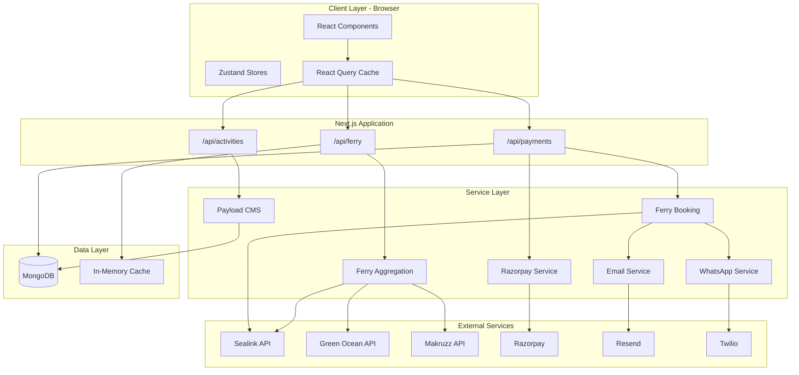
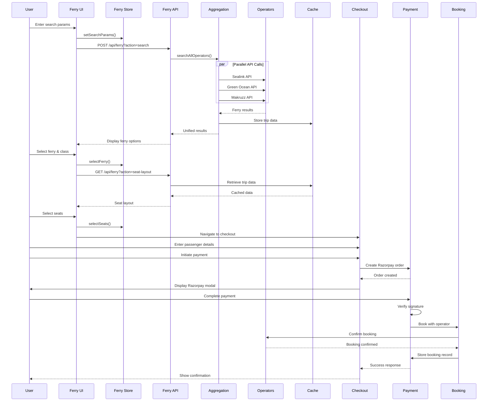
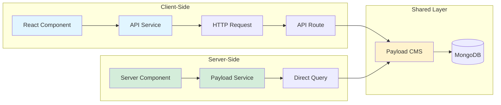
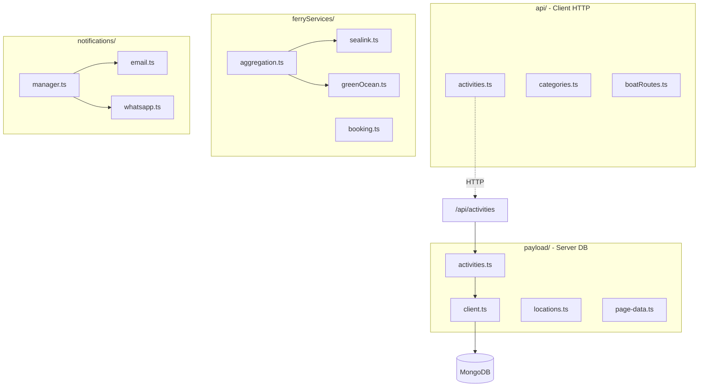
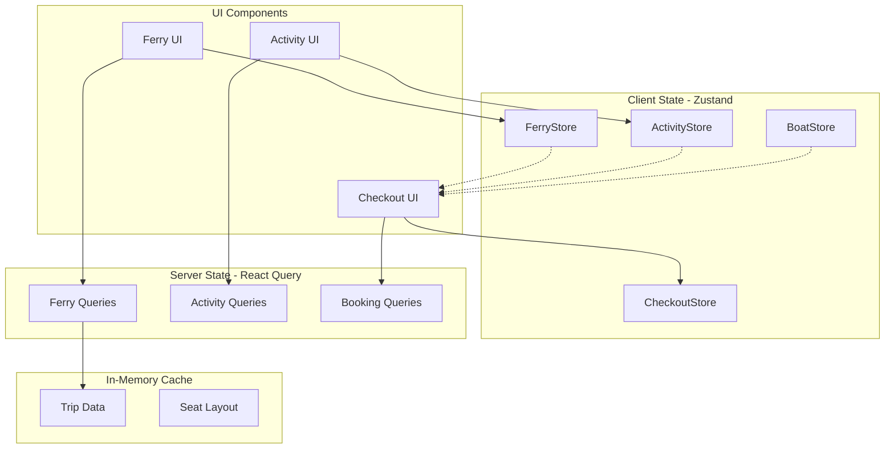
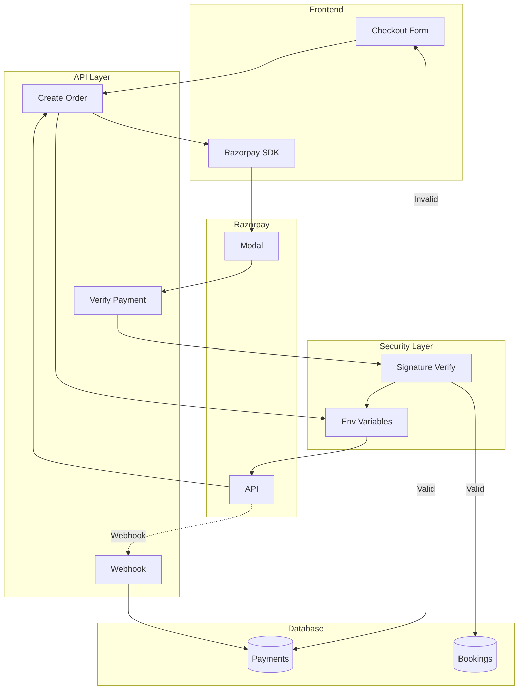
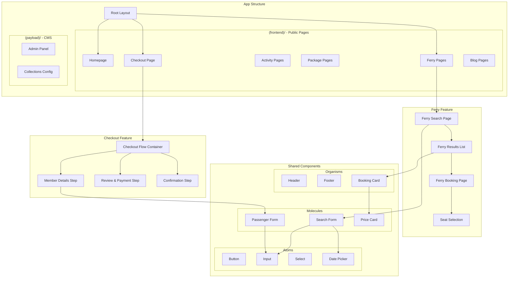
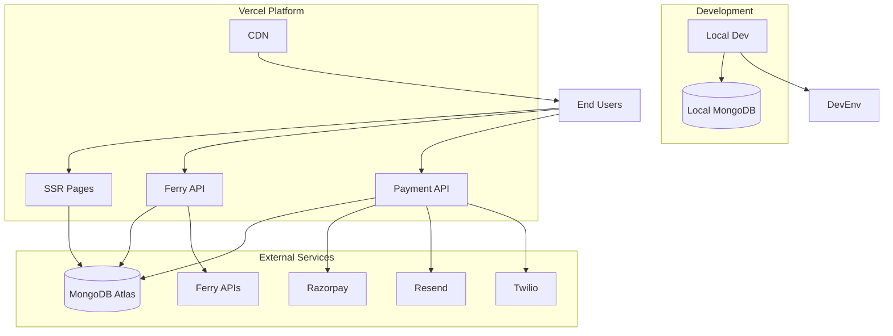

# Andaman Excursion - System Architecture Diagrams

> **Purpose**: Visual representations of the system architecture for quick understanding of data flows, component relationships, and integration points.

---

## 📐 Complete System Architecture

---

## 🚢 Ferry Booking System Flow

---

## 💳 Payment & Checkout Flow

```mermaid
graph LR
    CartData[Cart Data]
    URLParams[URL Params]
    Adapter[CheckoutAdapter]
    Step1[Step 1: Details]
    Step2[Step 2: Review]
    Step3[Step 3: Confirmation]
    CreateOrder[Create Order]
    RazorpayModal[Razorpay Modal]
    VerifyPayment[Verify Payment]
    SignatureCheck[Signature Check]
    PaymentRecord[Payment Record]
    BookingRecord[Booking Record]
    ProviderBooking[Provider Booking]
    Notifications[Notifications]
    
    CartData --> Adapter
    URLParams --> TypeDetection
    TypeDetection --> Adapter
    Adapter --> DataUnification
    DataUnification --> PassengerReqs
    DataUnification --> PaymentPrep
    
    PassengerReqs --> Step1
    Step1 --> Step2
    Step2 --> CreateOrder
    CreateOrder --> RazorpayModal
    RazorpayModal --> VerifyPayment
    VerifyPayment --> SignatureCheck
    
    SignatureCheck -->|Valid| PaymentRecord
    SignatureCheck -->|Invalid| Step3
    
    PaymentRecord --> BookingRecord
    BookingRecord --> ProviderBooking
    ProviderBooking --> Notifications
    Notifications --> Step3
    
    style SignatureCheck fill:#fff3cd
    style ProviderBooking fill:#f8d7da
```

---

## 📊 Data Access Patterns

---

## 🗂 Service Layer Organization

---

## 🔄 State Management Architecture

---

## 🔐 Security & Payment Architecture

---

## 📱 Component Hierarchy

---

## 🚀 Deployment Architecture

---

## 📝 Legend

### Diagram Types

- **Graph TB/LR** - Component relationships and data flow
- **Sequence** - Time-based interactions
- **Flowchart** - Process flows with decision points

---

*Use these diagrams as reference when discussing system architecture, debugging issues, or planning new features.*
