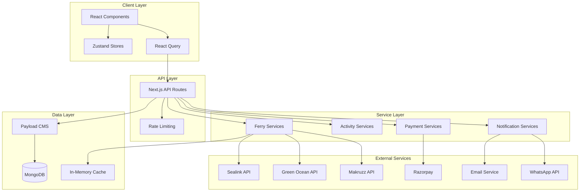
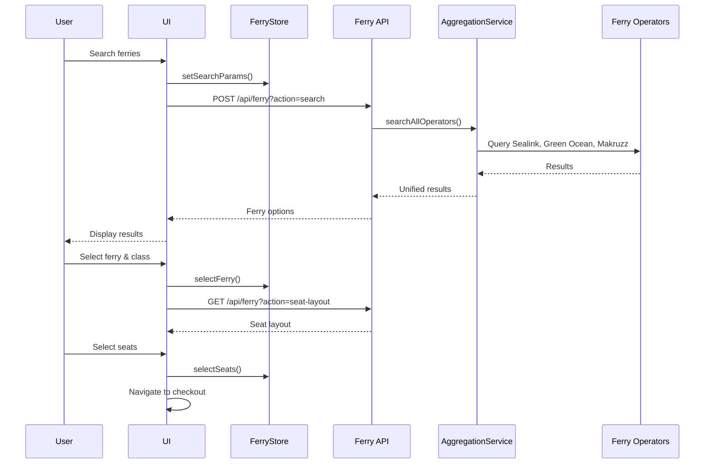
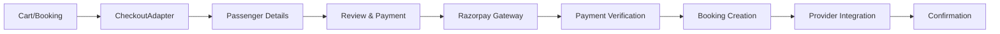

# 🚢 Andaman Excursion Platform - Developer Onboarding Guide

> **Purpose**: This comprehensive guide is designed to onboard new developers to the Andaman Excursion booking platform. It provides everything needed to understand the system architecture, set up the development environment, and start contributing effectively.

---

## 📑 Table of Contents

1. [Project Overview](#-project-overview)
2. [Technology Stack](#-technology-stack)
3. [Architecture Overview](#-architecture-overview)
4. [Getting Started](#-getting-started)
5. [Core Systems Deep Dive](#-core-systems-deep-dive)
6. [Development Workflows](#-development-workflows)
7. [Code Organization](#-code-organization)
8. [Testing & Debugging](#-testing--debugging)
9. [Deployment](#-deployment)
10. [Common Tasks](#-common-tasks)
11. [Troubleshooting](#-troubleshooting)
12. [Resources & Documentation](#-resources--documentation)

---

## 🎯 Project Overview

### What is Andaman Excursion?

Andaman Excursion is a **unified booking platform** for travel services in the Andaman & Nicobar Islands, specifically handling:

- **Ferry Bookings**: Integration with multiple ferry operators (Sealink, Green Ocean, Makruzz)
- **Activity Bookings**: Water sports, island tours, sightseeing activities
- **Boat Charters**: Private boat rentals and charter services
- **Package Tours**: Pre-designed multi-day travel packages

### Business Model

- **B2C Platform**: Direct customer bookings through web interface
- **Payment Processing**: Razorpay integration for secure payments
- **Multi-Operator Aggregation**: Unified interface for multiple ferry providers
- **Real-time Inventory**: Live seat availability and booking confirmation

### Key Features

✅ **Multi-Booking Support**: Handle activities, ferries, and boats in single checkout  
✅ **Real-time Ferry Search**: Aggregate results from multiple operators  
✅ **Seat Selection**: Visual ferry layouts with seat selection capability  
✅ **Secure Payments**: Razorpay integration with signature verification  
✅ **Automated Notifications**: Email and WhatsApp confirmations  
✅ **CMS-Powered Content**: Payload CMS for blogs, packages, and pages  

---

## 🛠 Technology Stack

### Frontend

| Technology | Version | Purpose |
|------------|---------|---------|
| **Next.js** | 15.3.4 | React framework with SSR/SSG |
| **React** | 19.0.0 | UI library |
| **TypeScript** | 5.x | Type-safe development |
| **Zustand** | 5.0.6 | Client-side state management |
| **React Query** | 5.83.0 | Server state & caching |
| **React Hook Form** | 7.60.0 | Form state management |
| **Zod** | 3.25.76 | Schema validation |

### Backend

| Technology | Version | Purpose |
|------------|---------|---------|
| **Payload CMS** | 3.54.0 | Headless CMS & database layer |
| **MongoDB** | 6.17.0 | Primary database |
| **Razorpay** | 2.9.6 | Payment gateway |
| **Resend** | 5.0.0 | Email service |
| **Twilio** | 5.8.2 | WhatsApp notifications |

### UI Components

- **Radix UI**: Accessible component primitives
- **Lucide React**: Icon library
- **CSS Modules**: Component-scoped styling

### Development Tools

- **pnpm**: Package manager
- **ESLint**: Code linting
- **TypeScript**: Type checking

---

## 🏗 Architecture Overview

### High-Level System Architecture



### Data Flow Patterns

#### Pattern 1: Client-Side Data Fetching
```
React Component → API Service (api/) → HTTP Request → Next.js API Route → Payload CMS → MongoDB
```

#### Pattern 2: Server-Side Data Fetching
```
Server Component → Payload Service (payload/) → Direct DB Query → MongoDB
```

#### Pattern 3: Ferry Booking Flow
```
User → Ferry Search → Aggregation Service → Multiple Ferry APIs → Unified Results → Seat Selection → Payment → Booking Confirmation
```

---

## 🚀 Getting Started

### Prerequisites

- **Node.js**: v18+ (v20 recommended)
- **pnpm**: v8+ (install via `npm install -g pnpm`)
- **MongoDB**: Local instance or MongoDB Atlas account
- **Git**: For version control

### Environment Setup

1. **Clone the repository**:
   ```bash
   git clone <repository-url>
   cd andamanexcursion-master
   ```

2. **Install dependencies**:
   ```bash
   pnpm install
   ```

3. **Set up environment variables**:
   
   Create a `.env` file in the root directory:
   
   ```env
   # Database
   DATABASE_URI=mongodb://localhost:27017/andaman
   PAYLOAD_SECRET=your-secret-key-min-32-chars
   
   # Application
   NEXT_PUBLIC_SITE_URL=http://localhost:3000
   NODE_ENV=development
   
   # Razorpay (Payment Gateway)
   RAZORPAY_KEY_ID=rzp_test_xxx
   RAZORPAY_KEY_SECRET=xxx
   NEXT_PUBLIC_RAZORPAY_KEY_ID=rzp_test_xxx
   RAZORPAY_WEBHOOK_SECRET=xxx
   
   # Ferry Operators
   SEALINK_API_URL=https://api.sealink.in/
   SEALINK_TOKEN=xxx
   MAKRUZZ_API_URL=https://api.makruzz.com/
   MAKRUZZ_API_KEY=xxx
   GREEN_OCEAN_API_URL=https://api.greenocean.in/
   GREEN_OCEAN_PUBLIC_KEY=xxx
   
   # Email Service (Resend)
   RESEND_API_KEY=re_xxx
   
   # WhatsApp (Twilio)
   TWILIO_ACCOUNT_SID=xxx
   TWILIO_AUTH_TOKEN=xxx
   TWILIO_WHATSAPP_NUMBER=whatsapp:+xxx
   
   # reCAPTCHA
   RECAPTCHA_SITE_KEY=xxx
   RECAPTCHA_SECRET_KEY=xxx
   NEXT_PUBLIC_RECAPTCHA_SITE_KEY=xxx
   
   # UploadThing (Media Storage)
   UPLOADTHING_SECRET=xxx
   UPLOADTHING_APP_ID=xxx
   ```

4. **Start MongoDB** (if running locally):
   ```bash
   mongod --dbpath /path/to/data/db
   ```

5. **Run the development server**:
   ```bash
   pnpm dev
   ```

6. **Access the application**:
   - **Frontend**: http://localhost:3000
   - **Payload Admin**: http://localhost:3000/admin

### First-Time Setup Checklist

- [ ] Clone repository
- [ ] Install dependencies with `pnpm install`
- [ ] Create `.env` file with all required variables
- [ ] Start MongoDB
- [ ] Run `pnpm dev`
- [ ] Access localhost:3000 to verify setup
- [ ] Create first admin user in Payload CMS
- [ ] Test ferry search functionality
- [ ] Test payment integration (use Razorpay test mode)

---

## 🔍 Core Systems Deep Dive

### 1. Ferry Booking System

The ferry booking system is the core feature, integrating multiple ferry operators.

#### Key Components

- **FerryAggregationService**: Orchestrates searches across all operators
- **FerryBookingService**: Handles booking creation with external APIs
- **Operator Services**: Sealink, Green Ocean, Makruzz integrations
- **FerryStore**: Client-side state management

#### Ferry Booking Flow



#### Important Files

- **Services**:
  - [ferryAggregationService.ts](file:///c:/Users/Lenovo/Downloads/andamanexcursion-master/andamanexcursion-master/src/services/ferryServices/ferryAggregationService.ts)
  - [ferryBookingService.ts](file:///c:/Users/Lenovo/Downloads/andamanexcursion-master/andamanexcursion-master/src/services/ferryServices/ferryBookingService.ts)
  - [sealinkService.ts](file:///c:/Users/Lenovo/Downloads/andamanexcursion-master/andamanexcursion-master/src/services/ferryServices/sealinkService.ts)
  
- **Store**: [FerryStore.ts](file:///c:/Users/Lenovo/Downloads/andamanexcursion-master/andamanexcursion-master/src/store/FerryStore.ts)

- **API Routes**: [/api/ferry/route.ts](file:///c:/Users/Lenovo/Downloads/andamanexcursion-master/andamanexcursion-master/src/app/api/ferry/route.ts)

- **Documentation**: [docs/FERRY_BOOKING_SYSTEM_ARCHITECTURE.md](file:///c:/Users/Lenovo/Downloads/andamanexcursion-master/andamanexcursion-master/docs/FERRY_BOOKING_SYSTEM_ARCHITECTURE.md)

---

### 2. Checkout & Payment System

Unified checkout handles all booking types through a single flow.

#### Checkout Architecture

The checkout system uses the **CheckoutAdapter** pattern to normalize different booking types:

```typescript
// CheckoutAdapter converts any booking type to unified format
const unifiedData = CheckoutAdapter.getUnifiedBookingData(
  bookingType,
  { ferryStore, activityStore, boatStore }
);
```

#### Checkout Flow



#### Payment Integration (Razorpay)

**Security**: All payments use HMAC SHA256 signature verification

```typescript
// Payment verification flow
const sign = razorpay_order_id + "|" + razorpay_payment_id;
const expectedSign = crypto
  .createHmac("sha256", process.env.RAZORPAY_KEY_SECRET!)
  .update(sign.toString())
  .digest("hex");

if (expectedSign === razorpay_signature) {
  // Payment verified - proceed with booking
}
```

#### Important Files

- **Adapter**: [CheckoutAdapter.ts](file:///c:/Users/Lenovo/Downloads/andamanexcursion-master/andamanexcursion-master/src/utils/CheckoutAdapter.ts)
- **Store**: [SimpleCheckoutStore.ts](file:///c:/Users/Lenovo/Downloads/andamanexcursion-master/andamanexcursion-master/src/store/SimpleCheckoutStore.ts)
- **Payment APIs**:
  - [create-order/route.ts](file:///c:/Users/Lenovo/Downloads/andamanexcursion-master/andamanexcursion-master/src/app/api/payments/create-order/route.ts)
  - [verify/route.ts](file:///c:/Users/Lenovo/Downloads/andamanexcursion-master/andamanexcursion-master/src/app/api/payments/verify/route.ts)
- **Documentation**:
  - [CHECKOUT_PROCESS_SYSTEM.md](file:///c:/Users/Lenovo/Downloads/andamanexcursion-master/andamanexcursion-master/docs/CHECKOUT_PROCESS_SYSTEM.md)
  - [RAZORPAY_INTEGRATION_DOCUMENTATION.md](file:///c:/Users/Lenovo/Downloads/andamanexcursion-master/andamanexcursion-master/docs/RAZORPAY_INTEGRATION_DOCUMENTATION.md)

---

### 3. Payload CMS Integration

Payload CMS provides both content management and database access.

#### Two Ways to Access Data

##### 1. Client-Side (Browser) - API Layer
```typescript
// Used in React components
import { activityApi } from '@/services/api/activities';

const activities = await activityApi.getAll();
// → Makes HTTP request to /api/activities
```

##### 2. Server-Side (Node.js) - Payload Local API
```typescript
// Used in API routes, server components
import { activityService } from '@/services/payload/collections/activities';

const activities = await activityService.getAll();
// → Direct database query via Payload
```

#### Service Layer Architecture

```
src/services/
├── api/                    # Client-side HTTP calls
│   ├── activities.ts
│   ├── activityCategories.ts
│   ├── boatRoutes.ts
│   └── locations.ts
├── payload/                # Server-side database access
│   ├── base/              # Core utilities
│   │   ├── client.ts      # Payload instance
│   │   └── queries.ts     # Generic queries
│   ├── collections/       # Collection services
│   │   ├── activities.ts
│   │   ├── locations.ts
│   │   └── packages.ts
│   └── composed/          # High-level services
│       └── page-data-service.ts
└── ferryServices/          # Ferry business logic
```

#### Important Files

- **Payload Config**: [payload.config.ts](file:///c:/Users/Lenovo/Downloads/andamanexcursion-master/andamanexcursion-master/src/payload.config.ts)
- **Collections**: [src/app/(payload)/collections/](file:///c:/Users/Lenovo/Downloads/andamanexcursion-master/andamanexcursion-master/src/app/(payload)/collections)
- **Documentation**: [SERVICES_ARCHITECTURE_DOCUMENTATION.md](file:///c:/Users/Lenovo/Downloads/andamanexcursion-master/andamanexcursion-master/SERVICES_ARCHITECTURE_DOCUMENTATION.md)

---

### 4. State Management

The application uses multiple state management approaches:

#### Zustand Stores (Client State)

| Store | Purpose | Persistence |
|-------|---------|-------------|
| **FerryStore** | Ferry search params, selection | No |
| **ActivityStoreRQ** | Activity cart, selections | No |
| **BoatStore** | Boat search, selections | No |
| **SimpleCheckoutStore** | Checkout form data, navigation | No |

#### React Query (Server State)

- **Caching**: 5-minute stale time for most queries
- **Retry Logic**: 3 retries with exponential backoff
- **Optimistic Updates**: For cart additions
- **Background Refetching**: Keep data fresh

#### In-Memory Caching

- **Ferry Trip Data**: Cached for booking flow continuity
- **Seat Layouts**: Prevent redundant API calls

---

## 💻 Development Workflows

### Creating a New Feature

#### Example: Adding a New Activity Category Filter

1. **Update Payload Collection** (if schema changes needed):
   ```typescript
   // src/app/(payload)/collections/ActivityCategories.ts
   // Add new field to collection
   ```

2. **Create Service Layer**:
   ```typescript
   // src/services/payload/collections/activity-categories.ts
   export const activityCategoryService = {
     async getByType(type: string) {
       const payload = await getCachedPayload();
       return await payload.find({
         collection: "activity-categories",
         where: { type: { equals: type } }
       });
     }
   };
   ```

3. **Create API Endpoint** (if needed):
   ```typescript
   // src/app/api/activity-categories/route.ts
   export async function GET(request: Request) {
     const categories = await activityCategoryService.getAll();
     return Response.json(categories);
   }
   ```

4. **Create React Query Hook**:
   ```typescript
   // src/hooks/queries/useActivityCategories.ts
   export function useActivityCategories() {
     return useQuery({
       queryKey: ['activity-categories'],
       queryFn: async () => {
         const res = await fetch('/api/activity-categories');
         return res.json();
       }
     });
   }
   ```

5. **Use in Component**:
   ```typescript
   // src/components/ActivityFilter.tsx
   const { data: categories } = useActivityCategories();
   ```

### Code Review Checklist

When reviewing code or creating PRs:

- [ ] TypeScript types properly defined (no `any`)
- [ ] Error handling implemented
- [ ] Loading states handled
- [ ] Validation schemas using Zod
- [ ] Proper cache invalidation (React Query)
- [ ] Environment variables documented
- [ ] No sensitive data in client-side code
- [ ] Proper CORS handling for API routes
- [ ] Responsive design tested
- [ ] Accessibility considerations (ARIA labels, keyboard navigation)

---

## 📁 Code Organization

### Directory Structure

```
andamanexcursion-master/
├── src/
│   ├── app/
│   │   ├── (frontend)/          # Public-facing pages
│   │   │   ├── page.tsx         # Homepage
│   │   │   ├── ferry/           # Ferry booking pages
│   │   │   ├── activities/      # Activity pages
│   │   │   ├── packages/        # Package pages
│   │   │   ├── checkout/        # Checkout flow
│   │   │   └── ...
│   │   ├── (payload)/           # CMS collections & admin
│   │   │   ├── collections/     # Payload collections
│   │   │   └── admin/           # Admin UI customization
│   │   └── api/                 # API routes
│   │       ├── ferry/
│   │       ├── activities/
│   │       ├── payments/
│   │       └── ...
│   ├── components/
│   │   ├── atoms/               # Basic components
│   │   ├── molecules/           # Composite components
│   │   ├── organisms/           # Complex components
│   │   ├── layout/              # Layout components
│   │   └── ferry/               # Ferry-specific components
│   ├── services/
│   │   ├── api/                 # Client-side API calls
│   │   ├── payload/             # Server-side Payload services
│   │   ├── ferryServices/       # Ferry business logic
│   │   └── notifications/       # Email/SMS services
│   ├── hooks/
│   │   ├── queries/             # React Query hooks
│   │   └── ferry/               # Ferry-specific hooks
│   ├── store/                   # Zustand stores
│   ├── utils/                   # Utility functions
│   ├── types/                   # TypeScript types
│   ├── constants/               # Constants & configs
│   └── styles/                  # Global styles
├── docs/                        # Documentation
│   ├── FERRY_BOOKING_SYSTEM_ARCHITECTURE.md
│   ├── CHECKOUT_PROCESS_SYSTEM.md
│   ├── RAZORPAY_INTEGRATION_DOCUMENTATION.md
│   └── SYSTEM_INTERDEPENDENCIES.md
├── public/                      # Static assets
├── .env                         # Environment variables
├── package.json
├── next.config.mjs
└── tsconfig.json
```

### Naming Conventions

#### Files
- **Components**: PascalCase (e.g., `FerrySearchForm.tsx`)
- **Utilities**: camelCase (e.g., `formatCurrency.ts`)
- **Types**: PascalCase with `.types.ts` (e.g., `Ferry.types.ts`)
- **Styles**: Component name + `.module.css` (e.g., `FerrySearchForm.module.css`)

#### Code
- **Components**: PascalCase (e.g., `FerrySearchForm`)
- **Functions**: camelCase (e.g., `formatCurrency()`)
- **Constants**: UPPER_SNAKE_CASE (e.g., `MAX_PASSENGERS`)
- **Interfaces**: PascalCase with `I` prefix optional (e.g., `FerryResult`)

---

## 🧪 Debugging


### Debugging Tips

#### React Query DevTools

Enable during development:

```typescript
// Add to _app.tsx
import { ReactQueryDevtools } from '@tanstack/react-query-devtools';

<ReactQueryDevtools initialIsOpen={false} />
```

#### Zustand DevTools

```typescript
// In store definition
import { devtools } from 'zustand/middleware';

export const useFerryStore = create(
  devtools(
    (set) => ({ /* store */ }),
    { name: 'FerryStore' }
  )
);
```

#### Common Debugging Scenarios

**Ferry Search Not Working**:
1. Check network tab for API calls
2. Verify ferry operator API credentials
3. Check in-memory cache state
4. Review aggregation service logs

**Payment Failing**:
1. Verify Razorpay keys in `.env`
2. Check signature verification logic
3. Review payment logs in console
4. Test with Razorpay test cards

**Checkout Flow Issues**:
1. Inspect CheckoutAdapter output
2. Check store state in Redux DevTools
3. Verify booking session data
4. Review validation errors

---

## 🚀 Deployment

### Vercel Deployment (Recommended)

1. **Connect Repository**:
   - Link GitHub repo to Vercel

2. **Configure Environment Variables**:
   - Add all `.env` variables in Vercel dashboard
   - Use Production Razorpay keys

3. **Build Settings**:
   ```
   Build Command: pnpm build
   Output Directory: .next
   Install Command: pnpm install
   ```

4. **Important Considerations**:
   - **Serverless Function Limit**: Vercel has 12-function limit for Hobby plan
   - **Cold Starts**: First request may be slow
   - **45-Second Timeout**: Long ferry bookings may timeout

### Environment-Specific Configuration

#### Development
```env
NEXT_PUBLIC_SITE_URL=http://localhost:3000
RAZORPAY_KEY_ID=rzp_test_xxx
```

#### Production
```env
NEXT_PUBLIC_SITE_URL=https://andamanexcursion.com
RAZORPAY_KEY_ID=rzp_live_xxx
```

### Database Migration

When deploying, ensure MongoDB is accessible:

- **Local Dev**: `mongodb://localhost:27017/andaman`
- **Production**: MongoDB Atlas connection string

---

## 🔧 Common Tasks

### Adding a New Ferry Operator

1. **Create Operator Service**:
   ```typescript
   // src/services/ferryServices/newOperatorService.ts
   export class NewOperatorService {
     async searchFerries(params: FerrySearchParams) {
       // Implement API integration
     }
     
     async bookFerry(bookingData: FerryBookingData) {
       // Implement booking logic
     }
   }
   ```

2. **Update Aggregation Service**:
   ```typescript
   // Add to ferryAggregationService.ts
   const newOperatorResults = await NewOperatorService.searchFerries(params);
   ```

3. **Add Location Mappings**:
   ```typescript
   // Update locationMappingService.ts
   newoperator: {
     'port-blair': 'PB',
     'havelock': 'HVL'
   }
   ```

4. **Update UnifiedFerryResult Type**:
   ```typescript
   operator: 'sealink' | 'greenocean' | 'makruzz' | 'newoperator';
   ```

### Modifying Checkout Flow

1. **Update CheckoutAdapter** if data structure changes
2. **Modify Validation Schemas** in `checkoutSchemas.ts`
3. **Update Components** in `checkout/components/`
4. **Test Payment Flow** end-to-end

### Adding New Payload Collection

1. **Define Collection**:
   ```typescript
   // src/app/(payload)/collections/NewCollection.ts
   export const NewCollection: CollectionConfig = {
     slug: 'new-collection',
     fields: [/* define fields */]
   };
   ```

2. **Register in Config**:
   ```typescript
   // payload.config.ts
   collections: [NewCollection, /* ... */]
   ```

3. **Create Service**:
   ```typescript
   // src/services/payload/collections/new-collection.ts
   export const newCollectionService = {
     async getAll() { /* ... */ }
   };
   ```

---

## 🐛 Troubleshooting

### Common Issues

#### Issue: "Payload not initialized"

**Cause**: Payload CMS not properly configured or MongoDB not running

**Solution**:
```bash
# Ensure MongoDB is running
mongod --dbpath /path/to/data

# Verify DATABASE_URI in .env
DATABASE_URI=mongodb://localhost:27017/andaman
```

#### Issue: Ferry search returns empty results

**Cause**: 
- Ferry operator APIs down
- Invalid credentials
- Cache issues

**Solution**:
1. Check operator API health endpoints
2. Verify API keys in `.env`
3. Clear in-memory cache
4. Check network logs

#### Issue: Payment verification fails

**Cause**:
- Signature mismatch
- Wrong Razorpay keys
- Webhook secret mismatch

**Solution**:
1. Verify Razorpay secret matches
2. Check signature calculation logic
3. Use Razorpay test mode for debugging
4. Review webhook logs

#### Issue: Build fails on Vercel

**Cause**:
- Missing environment variables
- Type errors
- Large bundle size

**Solution**:
1. Add all required env vars in Vercel
2. Run `pnpm build` locally to catch errors
3. Check bundle size with `next build --no-lint`

---

## 📚 Resources & Documentation

### Internal Documentation

#### Core System Docs
- [Ferry Booking System Architecture](file:///c:/Users/Lenovo/Downloads/andamanexcursion-master/andamanexcursion-master/docs/FERRY_BOOKING_SYSTEM_ARCHITECTURE.md)
- [Checkout Process System](file:///c:/Users/Lenovo/Downloads/andamanexcursion-master/andamanexcursion-master/docs/CHECKOUT_PROCESS_SYSTEM.md)
- [Razorpay Integration](file:///c:/Users/Lenovo/Downloads/andamanexcursion-master/andamanexcursion-master/docs/RAZORPAY_INTEGRATION_DOCUMENTATION.md)
- [Services Architecture](file:///c:/Users/Lenovo/Downloads/andamanexcursion-master/andamanexcursion-master/SERVICES_ARCHITECTURE_DOCUMENTATION.md)
- [System Interdependencies](file:///c:/Users/Lenovo/Downloads/andamanexcursion-master/andamanexcursion-master/docs/SYSTEM_INTERDEPENDENCIES.md)

#### Feature Docs
- [Activity Search & Booking](file:///c:/Users/Lenovo/Downloads/andamanexcursion-master/andamanexcursion-master/docs/ACTIVITY_SEARCH_BOOKING_SYSTEM.md)
- [Checkout Flow](file:///c:/Users/Lenovo/Downloads/andamanexcursion-master/andamanexcursion-master/docs/CHECKOUT_SYSTEM_FLOW.md)
- [Seat Layout Simplification](file:///c:/Users/Lenovo/Downloads/andamanexcursion-master/andamanexcursion-master/SEAT_LAYOUT_SIMPLIFICATION.md)

### External Resources

#### Technology Documentation
- [Next.js 15 Docs](https://nextjs.org/docs)
- [Payload CMS v3 Docs](https://payloadcms.com/docs)
- [React Query Docs](https://tanstack.com/query/latest)
- [Zustand Docs](https://docs.pmnd.rs/zustand)
- [Razorpay Docs](https://razorpay.com/docs/)

#### Learning Resources
- **Next.js**: Understanding App Router, Server Components
- **Payload CMS**: Local API vs REST API, Collections
- **State Management**: Zustand patterns, React Query caching
- **TypeScript**: Advanced types, Zod validation

---

## 🎯 Quick Start Checklist for New Developers

### Day 1: Environment Setup
- [ ] Clone repository
- [ ] Install dependencies with `pnpm install`
- [ ] Set up `.env` file
- [ ] Start MongoDB
- [ ] Run `pnpm dev` and verify localhost:3000 works
- [ ] Create Payload admin user

### Day 2: Understanding Architecture
- [ ] Read [FERRY_BOOKING_SYSTEM_ARCHITECTURE.md](file:///c:/Users/Lenovo/Downloads/andamanexcursion-master/andamanexcursion-master/docs/FERRY_BOOKING_SYSTEM_ARCHITECTURE.md)
- [ ] Review [SERVICES_ARCHITECTURE_DOCUMENTATION.md](file:///c:/Users/Lenovo/Downloads/andamanexcursion-master/andamanexcursion-master/SERVICES_ARCHITECTURE_DOCUMENTATION.md)
- [ ] Explore directory structure
- [ ] Familiarize with state management (Zustand stores)

### Day 3: Core Features
- [ ] Test ferry search functionality
- [ ] Understand CheckoutAdapter pattern
- [ ] Review payment flow documentation
- [ ] Test end-to-end booking with test Razorpay keys

### Day 4: Development Practice
- [ ] Make a small code change (e.g., add a console.log)
- [ ] Test the change locally
- [ ] Review code organization standards
- [ ] Set up debugging tools (React Query DevTools)

### Week 2: First Contribution
- [ ] Pick a small task from backlog
- [ ] Implement the feature
- [ ] Write tests (if applicable)
- [ ] Create pull request
- [ ] Address code review feedback

---

## 📞 Getting Help

### When Stuck

1. **Check Documentation**: Review internal docs first
2. **Search Codebase**: Use grep/search for similar patterns
3. **Ask Team**: Reach out on Slack/Teams
4. **External Resources**: Stack Overflow, GitHub issues

### Key Contacts

- **Lead Developer**: [Contact Info]
- **DevOps**: [Contact Info]
- **Product Manager**: [Contact Info]

---

## 🔐 Security Best Practices

### Environment Variables
- ✅ Never commit `.env` files
- ✅ Use Vercel environment variables for production
- ✅ Rotate API keys periodically
- ✅ Use separate keys for dev/production

### Payment Security
- ✅ Always verify Razorpay signatures
- ✅ Never expose secret keys in client side
- ✅ Validate all payment data server-side
- ✅ Log all payment transactions

### Data Protection
- ✅ Encrypt sensitive customer data
- ✅ Implement rate limiting on API routes
- ✅ Sanitize user inputs
- ✅ Use HTTPS in production

---

## 🎉 Conclusion

Welcome to the Andaman Excursion development team! This platform handles critical booking operations for travelers, so quality and reliability are paramount. Take time to understand the architecture, ask questions, and don't hesitate to suggest improvements.

**Happy Coding! 🚢✨**

---

*Last Updated: November 2025*  
*Version: 1.0*
