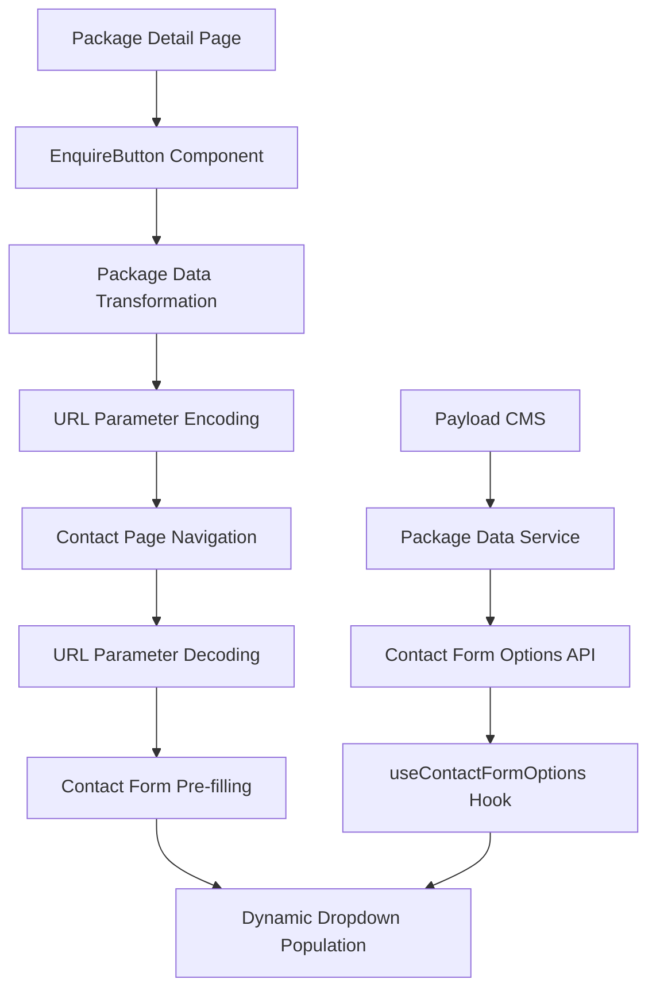

# Package Enquiry System Documentation

## Overview

The Package Enquiry System enables seamless data transfer from package detail pages to the contact form, automatically pre-filling the form with relevant package information for a better user experience.

## System Architecture



## Data Flow

### 1. Package Detail Page → Contact Form

#### Step 1: User Clicks Enquire Button

- User visits package detail page: `/packages/[category]/[id]`
- Clicks the "Enquire" button implemented via `EnquireButton` component

#### Step 2: Package Data Transformation

```typescript
// src/utils/enquiry.utils.ts
export function transformPackageToEnquiryData(
  packageData: PayloadPackage
): PackageEnquiryData {
  return {
    packageId: packageData.id,
    packageTitle: packageData.title,
    packageSlug: packageData.slug,
    categoryId: typeof category === "object" ? category.id : category,
    periodId: typeof period === "object" ? period.id : period,
    price: packageData.pricing?.price || 0,
    // ... other fields
  };
}
```

#### Step 3: URL Encoding & Navigation

```typescript
// Base64 encoding for safe URL transmission
export function encodePackageDataForURL(data: PackageEnquiryData): string {
  const jsonString = JSON.stringify(data);
  return btoa(encodeURIComponent(jsonString));
}

// Creates: /contact?pkg=<encoded-data>&ref=package-detail
```

#### Step 4: Contact Form Auto-filling

- Contact page decodes URL parameters
- Transforms data into form defaults
- Pre-fills form fields with package information

## Key Components

### 1. EnquireButton Component

**Location**: `src/components/atoms/EnquireButton/EnquireButton.tsx`

**Purpose**: Client-side component that generates dynamic enquiry URLs with package data.

```typescript
export function EnquireButton({
  packageData,
  children = "Enquire",
}: EnquireButtonProps) {
  const enquiryURL = useMemo(() => {
    try {
      const enquiryData = transformPackageToEnquiryData(packageData);
      return createEnquiryURL(enquiryData);
    } catch (error) {
      return "/contact"; // Fallback
    }
  }, [packageData]);

  return (
    <Button showArrow href={enquiryURL}>
      {children}
    </Button>
  );
}
```

**Key Features**:

- ✅ Memoized URL generation for performance
- ✅ Error handling with fallback to basic contact page
- ✅ Reusable across different package components

### 2. useEnquiryData Hook

**Location**: `src/app/(frontend)/contact/hooks/useEnquiryData.ts`

**Purpose**: Handles package enquiry data from URL parameters and provides form defaults.

```typescript
export function useEnquiryData() {
  const searchParams = useSearchParams();
  const contactFormOptions = useContactFormOptions();
  const [enquiryData, setEnquiryData] = useState<ValidatedEnquiryData>({
    isValid: false,
    source: "none",
  });

  // Decode URL parameters
  useEffect(() => {
    const packageParam = searchParams?.get("pkg");
    if (packageParam) {
      const decoded = decodePackageDataFromURL(packageParam);
      setEnquiryData(decoded);
    }
  }, [searchParams]);

  // Generate form defaults
  const formDefaults = useMemo(() => {
    return getContactFormDefaults(enquiryData, contactFormOptions);
  }, [
    enquiryData.packageId,
    enquiryData.periodId,
    contactFormOptions?.packages?.length,
  ]);

  return {
    enquiryData,
    formDefaults,
    hasPackageData: enquiryData.isValid && enquiryData.source === "url",
    packageInfo,
    contactFormOptions,
  };
}
```

**Key Features**:

- ✅ URL parameter decoding and validation
- ✅ Integration with contact form options
- ✅ Memoized form defaults generation
- ✅ Package information for UI display

### 3. useContactFormOptions Hook

**Location**: `src/app/(frontend)/contact/hooks/useContactFormOptions.ts`

**Purpose**: Fetches dynamic dropdown options from Payload CMS.

```typescript
export function useContactFormOptions() {
  const [options, setOptions] = useState<ContactFormOptions>({
    packages: [],
    periods: [],
    categories: [],
    isLoading: true,
  });

  useEffect(() => {
    async function fetchOptions() {
      const response = await fetch("/api/contact-form-options");
      const data = await response.json();
      setOptions({ ...data, isLoading: false });
    }
    fetchOptions();
  }, []);

  return {
    ...options,
    getPackageBySlug: (slug: string) =>
      options.packages.find((pkg) => pkg.slug === slug),
    getPeriodByValue: (value: string) =>
      options.periods.find((period) => period.value === value),
  };
}
```

**Key Features**:

- ✅ Caches dropdown options for performance
- ✅ Helper functions for easy lookups
- ✅ Loading state management

### 4. Contact Form Options Service

**Location**: `src/services/contact-form-options.service.ts`

**Purpose**: Server-side service to fetch and transform Payload CMS data for dropdowns.

```typescript
export const contactFormOptionsService = {
  async getAllOptions(): Promise<ContactFormOptions> {
    // Fetch data in parallel for better performance
    const [packages, periods, categories] = await Promise.all([
      packageService.getAll({ limit: 1000, depth: 2 }),
      packagePeriodService.getAll(),
      packageCategoryService.getAll(),
    ]);

    return {
      packages: packages.map((pkg) => ({
        id: pkg.id,
        title: pkg.title,
        slug: pkg.slug,
        price: pkg.pricing?.price,
      })),
      periods: periods.map((period) => ({
        id: period.id,
        title: period.title,
        value: period.value,
        order: period.order || 0,
      })),
      categories: categories.map((category) => ({
        id: category.id,
        title: category.title,
        slug: category.slug,
      })),
      isLoading: false,
    };
  },
};
```

## API Integration

### Contact Form Options API

**Endpoint**: `/api/contact-form-options`

```typescript
// src/app/api/contact-form-options/route.ts
export async function GET() {
  try {
    const options = await contactFormOptionsService.getAllOptions();

    return NextResponse.json(options, {
      headers: {
        "Cache-Control": "public, s-maxage=300, stale-while-revalidate=600", // 5min cache
      },
    });
  } catch (error) {
    return NextResponse.json(
      {
        /* fallback data */
      },
      { status: 500 }
    );
  }
}
```

**Features**:

- ✅ 5-minute caching for performance
- ✅ Graceful error handling with fallback data
- ✅ Stale-while-revalidate for better UX

## Form Integration

### Contact Page Implementation

**Location**: `src/app/(frontend)/contact/page.tsx`

```typescript
export default function ContactPage() {
  const { formDefaults, hasPackageData, packageInfo, contactFormOptions } =
    useEnquiryData();
  const [formInitialized, setFormInitialized] = useState(false);

  const form = useForm<ContactFormData>({
    resolver: zodResolver(contactFormSchema),
    mode: "onChange",
    defaultValues: {
      /* basic defaults */
    },
  });

  // Update form when enquiry data is ready
  useEffect(() => {
    if (
      !isLoading &&
      !formInitialized &&
      contactFormOptions &&
      !contactFormOptions.isLoading
    ) {
      if (hasPackageData && formDefaults) {
        // Clear saved form data to prevent conflicts
        clearSavedData();

        // Set form values with delayed Select component updates
        setTimeout(() => {
          form.setValue("booking.package", formDefaults.booking.package);
          form.setValue("booking.duration", formDefaults.booking.duration);
          // ... other fields
        }, 100);
      }
      setFormInitialized(true);
    }
  }, [
    isLoading,
    formInitialized,
    hasPackageData,
    formDefaults,
    contactFormOptions,
  ]);

  return (
    <div className={styles.contactPage}>
      {/* Package Enquiry Notice */}
      {hasPackageData && packageInfo && (
        <div className={styles.packageNotice}>
          <h3>Package Enquiry</h3>
          <p>
            You're enquiring about: <strong>{packageInfo.title}</strong>
          </p>
        </div>
      )}

      <ContactForm
        form={form}
        contactFormOptions={contactFormOptions}
        // ... other props
      />
    </div>
  );
}
```

### Dynamic Dropdown Population

**Location**: `src/app/(frontend)/contact/components/BookingDetails/BookingDetails.tsx`

```typescript
export const BookingDetails: React.FC<BookingDetailsProps> = ({
  form,
  contactFormOptions,
}) => {
  // Dynamic options from Payload CMS
  const packageOptions =
    contactFormOptions?.packages?.map((pkg: any) => ({
      value: pkg.slug,
      label: `${pkg.title}${
        pkg.price ? ` - ₹${pkg.price.toLocaleString()}` : ""
      }`,
      price: pkg.price,
    })) ||
    [
      /* fallback options */
    ];

  const durationOptions =
    contactFormOptions?.periods?.map((period: any) => ({
      value: period.value,
      label: period.title,
    })) ||
    [
      /* fallback options */
    ];

  return (
    <section className={styles.section}>
      {/* Package Select */}
      <Controller
        control={control}
        name="booking.package"
        render={({ field }) => (
          <Select.Root
            value={field.value || ""}
            onValueChange={field.onChange}
            defaultValue={field.value}
          >
            <Select.Trigger>
              <Select.Value placeholder="Select package">
                {packageOptions.find((option) => option.value === field.value)
                  ?.label || "Select package"}
              </Select.Value>
            </Select.Trigger>
            <Select.Content>
              <Select.Viewport>
                {packageOptions.map((option) => (
                  <Select.Item key={option.value} value={option.value}>
                    <Select.ItemText>{option.label}</Select.ItemText>
                  </Select.Item>
                ))}
              </Select.Viewport>
            </Select.Content>
          </Select.Root>
        )}
      />
    </section>
  );
};
```

## Technical Challenges & Solutions

### 1. Form Persistence Conflict

**Problem**: `useFormPersistence` hook was overriding enquiry data with saved form data.

**Solution**: Clear saved form data before setting enquiry values.

```typescript
// Clear saved form data to prevent conflicts
clearSavedData();
```

### 2. Select Component State Management

**Problem**: React Hook Form Controller with Radix UI Select components had timing issues.

**Solution**:

- Delayed value setting with `setTimeout`
- Added `defaultValue` prop for better initialization
- Enhanced error handling and logging

### 3. Infinite Render Loops

**Problem**: Multiple `useEffect` hooks creating circular dependencies.

**Solution**:

- Consolidated form update logic into single `useEffect`
- Used `useMemo` with specific dependencies
- Added form initialization tracking

### 4. Dynamic Option Matching

**Problem**: Form values didn't match dropdown options due to timing.

**Solution**:

- Wait for `contactFormOptions` to load before setting form values
- Validate option availability before form updates
- Graceful fallbacks for missing options

## Performance Optimizations

### 1. Memoization

```typescript
// Memoized form defaults to prevent unnecessary recalculations
const formDefaults = useMemo(() => {
  return getContactFormDefaults(enquiryData, contactFormOptions);
}, [
  enquiryData.packageId,
  enquiryData.periodId,
  contactFormOptions?.packages?.length,
  contactFormOptions?.periods?.length,
]);
```

### 2. API Caching

```typescript
// 5-minute cache with stale-while-revalidate
headers: {
  'Cache-Control': 'public, s-maxage=300, stale-while-revalidate=600',
}
```

### 3. Parallel Data Fetching

```typescript
// Fetch all data sources in parallel
const [packages, periods, categories] = await Promise.all([
  packageService.getAll({ limit: 1000, depth: 2 }),
  packagePeriodService.getAll(),
  packageCategoryService.getAll(),
]);
```

### 4. Scrollable Dropdowns

```css
.selectViewport {
  max-height: 200px;
  overflow-y: auto;
  scrollbar-width: thin;
  scrollbar-color: #cccccc transparent;
}
```

## Type Safety

### Core Types

```typescript
// src/types/enquiry.types.ts
export interface PackageEnquiryData {
  packageId: string;
  packageTitle: string;
  packageSlug: string;
  categoryId: string;
  categorySlug: string;
  periodId: string;
  periodTitle: string;
  price: number;
  originalPrice?: number;
  shortDescription?: string;
  defaultAdults?: number;
  defaultChildren?: number;
  defaultDuration?: number;
}

export interface ValidatedEnquiryData extends Partial<PackageEnquiryData> {
  isValid: boolean;
  source: "url" | "default" | "none";
}
```

### Contact Form Options Types

```typescript
// src/types/contact-form-options.types.ts
export interface PackageOption {
  id: string;
  title: string;
  slug: string;
  categoryTitle?: string;
  price?: number;
}

export interface PeriodOption {
  id: string;
  title: string;
  value: string;
  order: number;
}

export interface ContactFormOptions {
  packages: PackageOption[];
  periods: PeriodOption[];
  categories: CategoryOption[];
  isLoading: boolean;
  error?: string;
}
```

## Error Handling

### 1. URL Parameter Validation

```typescript
export function decodePackageDataFromURL(
  encodedData: string
): ValidatedEnquiryData {
  try {
    if (!encodedData) {
      return { isValid: false, source: "none" };
    }

    const jsonString = decodeURIComponent(atob(encodedData));
    const data = JSON.parse(jsonString) as PackageEnquiryData;

    // Validate required fields
    const isValid = Boolean(
      data.packageId &&
        data.packageTitle &&
        data.packageSlug &&
        data.categoryId &&
        data.periodId
    );

    return { ...data, isValid, source: "url" };
  } catch (error) {
    console.error("Failed to decode package data from URL:", error);
    return { isValid: false, source: "none" };
  }
}
```

### 2. API Fallbacks

```typescript
// Graceful fallbacks for missing data
const packageOptions = contactFormOptions?.packages?.map((pkg) => ({
  value: pkg.slug,
  label: pkg.title,
})) || [
  // Static fallback options
  { value: "beach-front-romance", label: "Beach Front Romance" },
];
```

### 3. Component Error Boundaries

- Form gracefully handles missing enquiry data
- Select components fall back to "Select option" placeholders
- Total amount shows "Select package for pricing" when no package is selected

## Testing & Debugging

### Debug Logging

The system includes comprehensive debug logging for troubleshooting:

```typescript
// Package enquiry processing
console.log("✅ Package enquiry processed:", {
  package: defaults.booking.package,
  duration: defaults.booking.duration,
  title: enquiryData.packageTitle,
});

// Form value setting
console.log("🔧 Set values:", {
  package: formDefaults.booking.package,
  duration: formDefaults.booking.duration,
  contactFormOptionsReady: !!contactFormOptions?.packages?.length,
});

// Select component debugging
console.log("🔍 Form field debug:", {
  package: watchedValues.package,
  packageFound:
    packageOptions.find((opt) => opt.value === watchedValues.package)?.label ||
    "NOT FOUND",
});
```

### Testing Checklist

1. ✅ Navigate from package detail to contact form
2. ✅ Verify package and duration dropdowns are pre-selected
3. ✅ Check total amount displays correct pricing
4. ✅ Confirm message field is pre-filled with package description
5. ✅ Test with different packages and periods
6. ✅ Verify fallback behavior when enquiry data is missing
7. ✅ Test dropdown scrolling with many options

## Maintenance & Extension

### Adding New Form Fields

1. Update `PackageEnquiryData` interface
2. Modify `transformPackageToEnquiryData()` function
3. Update `getContactFormDefaults()` function
4. Add form field to contact form component

### Adding New Dropdown Options

1. Update Payload CMS collections
2. Modify `contactFormOptionsService.getAllOptions()`
3. Update corresponding TypeScript interfaces
4. Add new dropdown to `BookingDetails` component

### Performance Monitoring

- Monitor API response times for `/api/contact-form-options`
- Track form completion rates with pre-filled data
- Monitor error rates in URL parameter decoding

## Security Considerations

### URL Parameter Safety

- Base64 encoding prevents URL injection
- JSON parsing includes error handling
- Validation of decoded data before use

### API Security

- Read-only access to Payload CMS data
- Caching headers for CDN optimization
- No sensitive data exposed in URLs

## Browser Compatibility

- ✅ Modern browsers with ES6+ support
- ✅ React 19+ and Next.js 15+
- ✅ Uses standard Web APIs (URLSearchParams, btoa/atob)
- ✅ Graceful degradation for missing features

## Conclusion

The Package Enquiry System provides a seamless user experience by automatically connecting package browsing with the enquiry process. The implementation emphasizes:

- **Performance**: Optimized with caching, memoization, and parallel data fetching
- **Reliability**: Comprehensive error handling and fallback mechanisms
- **Maintainability**: Type-safe, well-documented, and modularly designed
- **User Experience**: Smooth transitions with visual feedback and pre-filled forms

The system is production-ready and designed for easy extension as new features are needed.
