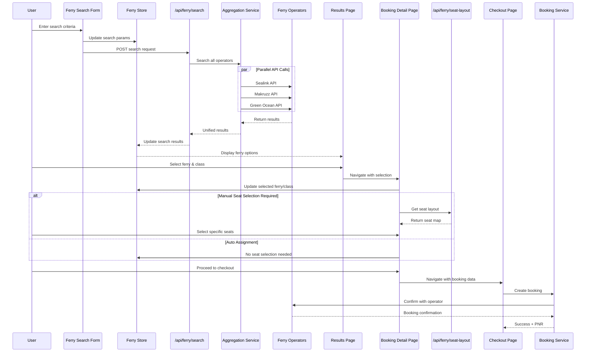

# Ferry Booking System Architecture Diagram

```mermaid
graph TB
    %% User Interface Layer
    subgraph "Frontend Components"
        A[Ferry Search Form] --> B[Ferry Results Page]
        B --> C[Ferry Card Components]
        C --> D[Ferry Booking Detail Page]
        D --> E[Seat Selection Component]
        E --> F[Checkout Page]
    end

    %% State Management
    subgraph "State Management"
        G[FerryStore - Zustand]
        H[Booking Session]
        I[Search Parameters]
        J[Selected Ferry/Class/Seats]
    end

    %% API Layer
    subgraph "API Endpoints"
        K[/api/ferry/search]
        L[/api/ferry/seat-layout]
        M[/api/ferry/booking/create-session]
        N[/api/ferry/health]
        O[/api/ferry/tickets/download]
    end

    %% Service Layer
    subgraph "Ferry Services"
        P[Ferry Aggregation Service]
        Q[Ferry Booking Service]
        R[Sealink Service]
        S[Makruzz Service]
        T[Green Ocean Service]
        U[Location Mapping Service]
        V[PDF Service]
    end

    %% External APIs
    subgraph "External Ferry Operators"
        W[Sealink API<br/>Manual + Auto Seats]
        X[Makruzz API<br/>Auto Seats Only]
        Y[Green Ocean API<br/>Manual Seats Required]
    end

    %% Configuration
    subgraph "Configuration"
        Z[Ferry Config<br/>Operators, Routes, Timeouts]
        AA[Environment Variables<br/>API Keys, URLs]
    end

    %% Data Flow Connections
    A --> G
    G --> K
    K --> P
    P --> R
    P --> S
    P --> T
    R --> W
    S --> X
    T --> Y
    
    B --> G
    C --> G
    D --> G
    D --> L
    L --> R
    L --> T
    
    E --> G
    F --> M
    M --> H
    F --> Q
    Q --> R
    Q --> S
    Q --> T
    Q --> V
    
    P --> U
    P --> Z
    R --> AA
    S --> AA
    T --> AA

    %% Styling
    classDef frontend fill:#e1f5fe
    classDef state fill:#f3e5f5
    classDef api fill:#e8f5e8
    classDef service fill:#fff3e0
    classDef external fill:#ffebee
    classDef config fill:#f1f8e9

    class A,B,C,D,E,F frontend
    class G,H,I,J state
    class K,L,M,N,O api
    class P,Q,R,S,T,U,V service
    class W,X,Y external
    class Z,AA config
```

## Component Flow Diagram



## Data Structure Flow

```mermaid
graph LR
    subgraph "Search Phase"
        A1[FerrySearchParams] --> A2[UnifiedFerryResult[]]
        A2 --> A3[FerryClass[]]
        A3 --> A4[Pricing & Availability]
    end

    subgraph "Selection Phase"
        B1[Selected Ferry] --> B2[Selected Class]
        B2 --> B3[SeatLayout?]
        B3 --> B4[Selected Seats[]]
    end

    subgraph "Booking Phase"
        C1[FerryBookingSession] --> C2[PassengerDetail[]]
        C2 --> C3[FerryBookingRequest]
        C3 --> C4[FerryBookingResponse]
        C4 --> C5[PNR & Confirmation]
    end

    A2 --> B1
    B4 --> C1
    C5 --> D1[PDF Tickets]

    classDef search fill:#e3f2fd
    classDef selection fill:#f3e5f5
    classDef booking fill:#e8f5e8
    classDef output fill:#fff3e0

    class A1,A2,A3,A4 search
    class B1,B2,B3,B4 selection
    class C1,C2,C3,C4,C5 booking
    class D1 output
```

## Operator-Specific Features

```mermaid
graph TB
    subgraph "Sealink Features"
        S1[Manual Seat Selection ✓]
        S2[Auto Assignment ✓]
        S3[Trip ID Based Booking]
        S4[Vessel ID Required]
    end

    subgraph "Makruzz Features"
        M1[Manual Seat Selection ✗]
        M2[Auto Assignment ✓]
        M3[Schedule ID Based Booking]
        M4[PDF Ticket Generation]
    end

    subgraph "Green Ocean Features"
        G1[Manual Seat Selection ✓]
        G2[Auto Assignment ✗]
        G3[Real-time Seat Blocking]
        G4[Route ID + Ship ID Booking]
    end

    subgraph "Unified Interface"
        U1[Common Search API]
        U2[Standardized Results]
        U3[Operator-Agnostic UI]
    end

    S1 --> U3
    S2 --> U3
    M2 --> U3
    G1 --> U3
    
    U1 --> S3
    U1 --> M3
    U1 --> G4
    
    U2 --> S1
    U2 --> M1
    U2 --> G1

    classDef sealink fill:#e3f2fd
    classDef makruzz fill:#f3e5f5
    classDef greenocean fill:#e8f5e8
    classDef unified fill:#fff3e0

    class S1,S2,S3,S4 sealink
    class M1,M2,M3,M4 makruzz
    class G1,G2,G3,G4 greenocean
    class U1,U2,U3 unified
```



## File Structure Overview

```
src/
├── app/
│   ├── (frontend)/
│   │   ├── ferry/
│   │   │   ├── page.tsx                    # Ferry landing page
│   │   │   ├── results/
│   │   │   │   ├── page.tsx               # Search results display
│   │   │   │   └── components/
│   │   │   │       ├── FerryResults.tsx   # Results list component
│   │   │   │       ├── SearchSummary.tsx  # Search info display
│   │   │   │       └── TimeFilters.tsx    # Time-based filtering
│   │   │   └── booking/
│   │   │       └── [id]/
│   │   │           └── page.tsx           # Ferry booking detail page
│   │   └── checkout/
│   │       └── page.tsx                   # Checkout & payment
│   └── api/
│       └── ferry/
│           ├── search/route.ts            # Ferry search endpoint
│           ├── seat-layout/route.ts       # Seat layout endpoint
│           ├── booking/create-session/    # Booking session creation
│           ├── health/route.ts            # API health check
│           └── tickets/[pnr]/download/    # Ticket download
├── components/
│   ├── atoms/
│   │   ├── FerryStatusIndicator/          # API status display
│   │   ├── LocationSelect/                # Location dropdown
│   │   ├── DateSelect/                    # Date picker
│   │   ├── SlotSelect/                    # Time slot selector
│   │   └── PassengerCounter/              # Passenger count controls
│   ├── molecules/
│   │   ├── Cards/
│   │   │   ├── FerryCard/                 # Ferry option display
│   │   │   │   ├── FerryCard.tsx
│   │   │   │   ├── FerryCard.types.ts
│   │   │   │   └── components/
│   │   │   │       ├── FerryClassCard.tsx # Class selection card
│   │   │   │       ├── FerryHeader.tsx    # Ferry info header
│   │   │   │       └── ...
│   │   │   └── BoatCard/                  # Alternative boat display
│   │   ├── SeatLayout/
│   │   │   └── SeatLayout.tsx             # Interactive seat map
│   │   └── BookingResults/
│   │       ├── FerryResults.tsx           # Results container
│   │       └── BoatResults.tsx            # Boat results container
│   └── organisms/
│       └── UnifiedSearchingForm/
│           └── components/
│               ├── FerrySearchForm.tsx    # Main search form
│               └── BoatSearchForm.tsx     # Boat search form
├── services/
│   └── ferryServices/
│       ├── ferryAggregationService.ts     # Multi-operator coordinator
│       ├── ferryBookingService.ts         # Booking orchestrator
│       ├── sealinkService.ts              # Sealink API integration
│       ├── makruzzService.ts              # Makruzz API integration
│       ├── greenOceanService.ts           # Green Ocean API integration
│       └── locationMappingService.ts      # Location standardization
├── store/
│   └── FerryStore.ts                      # Zustand state management
├── types/
│   └── FerryBookingSession.types.ts       # TypeScript definitions
├── config/
│   └── ferryConfig.ts                     # Operator configurations
└── utils/
    ├── ferryCache.ts                      # Caching utilities
    └── amenityIconMapping.ts              # UI icon mappings
```
