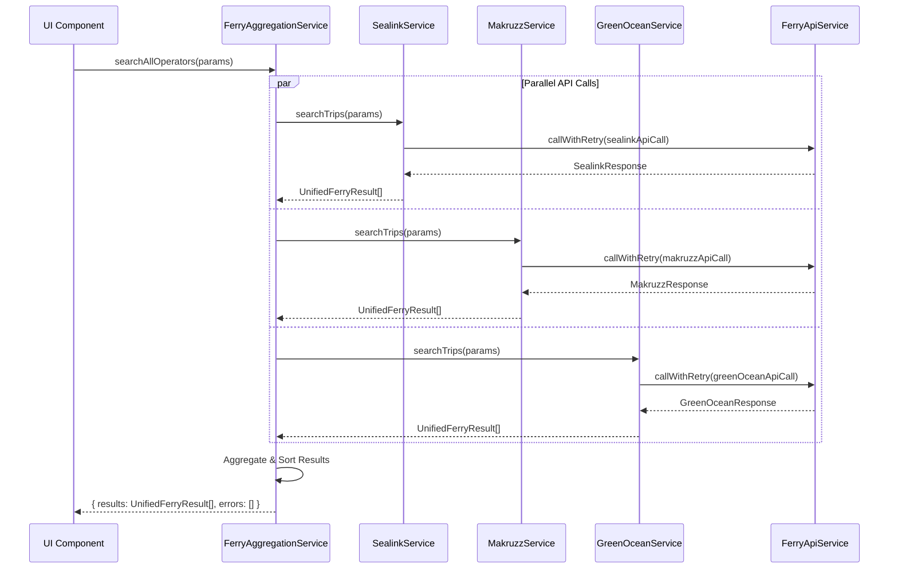

# Ferry Services Architecture

This directory contains the service layer for ferry booking functionality. Here's how the architecture works:

## 📁 File Structure & Responsibilities

```
ferryServices/
├── README.md                     # This file - architecture overview
├── ferryAggregationService.ts    # 🎯 MAIN ORCHESTRATOR - aggregates all ferry operators
├── ferryApiService.ts            # 🔧 UTILITY SERVICE - retry/timeout/error handling
├── sealinkService.ts             # 🚢 SEALINK API - handles Sealink/Nautika ferries
├── makruzzService.ts             # 🚢 MAKRUZZ API - handles Makruzz ferries
└── greenOceanService.ts          # 🚢 GREEN OCEAN API - handles Green Ocean ferries
```

## 🔄 How It All Works Together

### 1. **User Initiates Search**

```typescript
// From your UI components or API routes
const results = await FerryAggregationService.searchAllOperators({
  from: "port-blair",
  to: "havelock",
  date: "2024-12-20",
  adults: 2,
  children: 0,
  infants: 0,
});
```

### 2. **FerryAggregationService (Main Orchestrator)**

- **Purpose**: Calls all 3 ferry operators in parallel
- **Returns**: Unified results + error reports
- **What it does**:
  ```typescript
  searchAllOperators() → [
    SealinkService.searchTrips(),      // Parallel call 1
    MakruzzService.searchTrips(),      // Parallel call 2
    GreenOceanService.searchTrips()    // Parallel call 3
  ] → UnifiedFerryResult[]
  ```

### 3. **Individual Operator Services**

Each operator service handles:

- **API authentication** (different for each operator)
- **Request formatting** (different date formats, parameters)
- **Response transformation** → `UnifiedFerryResult`
- **Error handling** specific to that operator

### 4. **FerryApiService (Utility Layer)**

- **Purpose**: Provides robust API calling with retry logic
- **Used by**: All individual operator services
- **Features**:
  - Automatic retries with exponential backoff
  - Timeout handling (10 seconds)
  - Non-retryable error detection (auth failures)

## 🚢 Individual Operator Details

### **SealinkService** (Sealink & Nautika)

```typescript
// API Features:
✅ Manual seat selection
✅ Auto seat assignment
✅ Multiple vessel types (Sealink=1, Nautika=2)
✅ Two classes: Luxury (L) & Royal (R)

// Authentication: Username + Token
// Date Format: dd-mm-yyyy
// Seat Selection: Full seat map with availability
```

### **MakruzzService** (Makruzz & Makruzz Gold)

```typescript
// API Features:
❌ No manual seat selection
✅ Auto seat assignment only
✅ Token-based auth (login first)
✅ Classes: Premium, Deluxe

// Authentication: Username + Password → Token
// Date Format: yyyy-mm-dd
// Seat Selection: Auto-assignment only
```

### **GreenOceanService** (Green Ocean 1 & 2)

```typescript
// API Features:
✅ Manual seat selection required
✅ Temporary seat blocking
✅ Multiple classes: Economy, Premium, Royal
❌ No auto-assignment

// Authentication: Public Key + SHA-512 Hash
// Date Format: dd-mm-yyyy
// Seat Selection: Required with temporary blocking
```

## 📊 Data Flow Example



## 🔧 Usage Examples

### **Basic Search**

```typescript
import { FerryAggregationService } from "@/services/ferryServices/ferryAggregationService";

const { results, errors } = await FerryAggregationService.searchAllOperators({
  from: "port-blair",
  to: "havelock",
  date: "2024-12-20",
  adults: 2,
  children: 0,
  infants: 0,
});

// results: UnifiedFerryResult[] - All available ferries across operators
// errors: { operator: string, error: string }[] - Any API failures
```

### **Get Seat Layout (Green Ocean)**

```typescript
import { GreenOceanService } from "@/services/ferryServices/greenOceanService";

const seatLayout = await GreenOceanService.getSeatLayout(
  routeId,
  ferryId,
  classId,
  travelDate
);
// Returns: SeatLayout with individual seat availability
```

### **With Caching**

```typescript
// All services automatically use FerryCache
// Cache Duration: 5 minutes
// Cache Key: "operator:from:to:date:adults:children"

// First call - hits API
const results1 = await FerryAggregationService.searchAllOperators(params);

// Second call within 5 minutes - returns cached results
const results2 = await FerryAggregationService.searchAllOperators(params);
```

## 🛠️ Environment Variables Required

Add these to your `.env` file:

```env
# Sealink Configuration
SEALINK_USERNAME=your_sealink_username
SEALINK_TOKEN=your_sealink_token
SEALINK_API_URL=https://api.gonautika.com:8012/

# Makruzz Configuration
MAKRUZZ_USERNAME=your_makruzz_username
MAKRUZZ_PASSWORD=your_makruzz_password
MAKRUZZ_API_URL=https://staging.makruzz.com/booking_api/

# Green Ocean Configuration
GREEN_OCEAN_PUBLIC_KEY=your_public_key
GREEN_OCEAN_PRIVATE_KEY=your_private_key
GREEN_OCEAN_API_URL=https://tickets.greenoceanseaways.com/api/v1/

# Rate Limiting
FERRY_API_RATE_LIMIT=100
```

## 🧪 Testing Strategy

### **Unit Tests**

- Test each operator service individually
- Mock external API calls
- Test data transformation logic

### **Integration Tests**

- Test FerryAggregationService with mocked operator services
- Test error handling when individual operators fail
- Test caching behavior

### **API Tests**

- Test with actual operator APIs (staging environment)
- Test authentication flows
- Test rate limiting

## ⚠️ Error Handling

### **Graceful Degradation**

```typescript
// If Sealink fails but others succeed:
{
  results: [...makruzzResults, ...greenOceanResults],
  errors: [{ operator: "sealink", error: "API timeout" }]
}

// If all operators fail:
{
  results: [],
  errors: [
    { operator: "sealink", error: "..." },
    { operator: "makruzz", error: "..." },
    { operator: "greenocean", error: "..." }
  ]
}
```

### **Retry Logic**

- **Max Retries**: 2 attempts per API call
- **Timeout**: 10 seconds per attempt
- **Backoff**: Exponential (1s, 2s, 4s...)
- **Non-Retryable**: Authentication failures

## 🚀 Next Steps

1. **Add Environment Variables** to your `.env` file
2. **Test Individual Services** with your API credentials
3. **Integrate with FerryStore** for state management
4. **Create UI Components** that use FerryAggregationService
5. **Add API Routes** in `app/api/ferry/` for frontend integration

## 🔗 Integration Points

### **With FerryStore**

```typescript
// In your FerryStore
import { FerryAggregationService } from "@/services/ferryServices/ferryAggregationService";

const searchFerries = async (params: FerrySearchParams) => {
  setIsLoading(true);
  try {
    const { results, errors } =
      await FerryAggregationService.searchAllOperators(params);
    setSearchResults(results);
    if (errors.length > 0) {
      console.warn("Some ferry operators failed:", errors);
    }
  } finally {
    setIsLoading(false);
  }
};
```

### **With Checkout System**

```typescript
// Ferry results integrate seamlessly with existing checkout
const ferryBooking: CheckoutItem = {
  type: "ferry",
  ferryBooking: ferryBookingSession,
};
```

This architecture provides a robust, scalable foundation for ferry booking that integrates seamlessly with your existing activities booking system! 🎉
